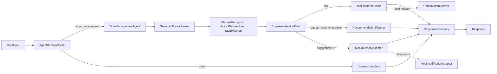

# Agent V3 → V5 Mock-First 实施计划

## 命名与目录约定

- 项目内既有 `docs/V1` … `docs/V3.6` 表示整体项目版本，**避免冲突**，本轮新增的版本统一称 **Agent V3 / Agent V4 / Agent V5**。
- 所有报告和闭关材料放在 `reports/`（仓库根目录新建），不污染 `docs/`。
- 公共 mock 基础设施放在 `src/agent/testing/`（生产代码不再 import 它，只被测试文件引用）。
- Mock 适配器接口放在 `src/agent/memory/`、`src/agent/notification/`，生产侧仅暴露 interface + Mock 实现，**禁止**真实接入。

## 强约束（贯穿所有 Phase）

- 不接真实 LLM / RAG / 通知；不调真实 DeepSeek（保留现有 `DeepSeekClient.ts`，但默认禁用，且不在新链路里启用）。
- 不破坏 V2 封板能力：现有 39 条测试必须始终绿。
- 所有写库操作必须经 ToolRouter → Tool → Service，不允许 Handler/Agent 直接改 store。
- delete / batch / 自动重排必须经 `ConfirmationService` 走确认链路。
- 每个 Phase 验收命令固定：`pnpm exec tsc --noEmit`、`pnpm test`、`pnpm build`（同 `docs/V3.6/V3.6.2-closure-report.md` 五.验证记录的口径）。

## 总体数据流（演进后）

---

## Phase 0 — Baseline Audit

**目标**：用一次干净的验证记录确认 V2 封板状态没漂移，并把"V3 起点"写下来。

**动作**

- 跑 `pnpm exec tsc --noEmit`、`pnpm test`、`pnpm build`，记录耗时和 warning（Vite chunk size warning 允许保留）。
- 整理现有 router / planner / handler / boundary / tests 文件清单 + 锚点。
- 识别 V2 封板能力边界（来源 [docs/V3.6/V3.6.2-closure-report.md](docs/V3.6/V3.6.2-closure-report.md) 二、三节）。

**产物**：`reports/V3_BASELINE_AUDIT.md`

**验收**：三条命令全部通过；如有失败，先在 Phase 0 内修复，否则停止并出 BLOCKED report。

---

## Phase 1 — 统一 Mock 验证路径

**目标**：把现在散在两个测试文件里的 in-memory service 公共化，并补齐 Memory / RAG / Notification adapter 与 PlannerPort 接口骨架，作为后续 V3/V4/V5 复用基线。

**关于 "rule" 的澄清（避免命名冗余）**

- 当前代码里和"规则"相关的活跃组件只有 [src/agent/experience/SemanticFrameParser.ts](src/agent/experience/SemanticFrameParser.ts)（正则 + 关键词字典识别 userGoal / 时间 / 标题）。
- 旧的 [src/agent/IntentParser.ts](src/agent/IntentParser.ts)（包含 `PatternRule` / `class IntentParser`）是 V3.6.1 改造后的孤儿代码，全局没有 import；本计划不再视它为"规则 planner"。
- `ActionPlanner` 本身不是"rule planner"，它只是按 `SemanticFrame.userGoal` 生成 `ExperienceActionPlan` 的工厂；本 Phase 让它实现 `PlannerPort`，不另造名字。

**新增目录与文件**

- `src/agent/testing/`
  - `memoryServices.ts`：抽出现有 `MemoryTaskService` / `MemoryTimeBlockService` / `MemoryScheduleService` / `MemoryConfirmationRepository` / `MemoryActionLogPort` 五件套（来源：[src/agent/__tests__/agent_router_gold.test.ts](src/agent/__tests__/agent_router_gold.test.ts) 与 [src/agent/experience/__tests__/v3_6_1_pipeline.test.ts](src/agent/experience/__tests__/v3_6_1_pipeline.test.ts)）。
  - `createMockAgentHarness.ts`：统一装配 `AgentService`，返回 `{ agent, tasks, blocks, confirmRepo, logs, memory, rag, notifier }`。
  - `mockInput.ts`：`mockUserInput(text, overrides?)`、`expectNoInternalNames(message)`、`expectRefreshHints(...)`、`expectConfirmationRequired(...)` 等小工具。
- `src/agent/testing/__tests__/mock_smoke.test.ts`：smoke 用例（必须 ≥ 5 条断言）：
  1. 「我现在有一个写文档任务，10 分钟，从现在开始」 → 进入 `time_management`，写 1 task + 1 block。
  2. 「明天下午三点提醒我开会」 → `time_management`，**不**走 `general_chat`。
  3. 「删除写文档任务」 → `confirmation_required`，未删除。
  4. Mock store 写入只发生在 ToolRouter 调用链路里，不会绕过。
  5. `ResponseBoundary.finalize()` 输出不包含 `userGoal` / `toolName` / `delete_task` 等内部名。

**新增/重构的 mock 接口（先建空骨架，V4/V5 才填语义）**

- `src/agent/memory/MemoryAdapter.ts` — interface：`recordTaskCompletion`、`recordSchedule`、`getRecentBehavior(window)`。
- `src/agent/memory/MockMemoryAdapter.ts` — 进程内数组实现，附 `dump()` 给测试。
- `src/agent/memory/RagAdapter.ts` — interface：`retrieveRelatedHistory(query)` 返回 `{ snippets: string[] }`。
- `src/agent/memory/MockRagAdapter.ts` — 返回固定 mock 摘要（用于断言不接真实库）。
- `src/agent/notification/NotificationAdapter.ts` — interface：`notify({channel,title,message,scheduledAt?})`。
- `src/agent/notification/MockNotificationAdapter.ts` — 仅 push 到 `events: NotificationEvent[]`，附 `drain()`。
- `src/agent/experience/PlannerPort.ts` — interface：`plan(frame, context) → Promise<ExperienceActionPlan>`。**现有 `ActionPlanner` 实现该接口**，本 Phase 不改它的逻辑，只加 `implements PlannerPort`。生产侧**只有这一份实现**。
- `src/agent/testing/StubPlanner.ts` —— 仅在测试目录下，**不**出现在生产代码。用于 V3 防御性测试：可注入预设的非法 plan（不存在的 toolName、空 kind、越权 params），验证 `AgentService` / `TimeManagementAgent` 能正确拦截。

**注入方式**

- `AgentService` 构造选项增加（可选项，不破坏现有 API）：`plannerPort?: PlannerPort`、`memoryAdapter?: MemoryAdapter`、`ragAdapter?: RagAdapter`、`notificationAdapter?: NotificationAdapter`。
- 不传时使用现状（ActionPlanner + 无 memory/rag/notification）；测试 harness 默认注入 Mock 版本，**生产代码不改 default 注入**，保证 V2 行为不变。

**产物**

- `reports/MOCK_VERIFICATION_GUIDE.md`：使用指南、如何写一条新 mock case。
- `reports/PHASE_1_MOCK_CLOSURE_REPORT.md`：三条命令结果、新增/重构文件清单、mock smoke 5 条结果。

**验收**

- 三条命令通过；mock smoke 5 条全绿；现有 39 条测试仍全绿。

---

## Phase 2 — Agent V3：链路稳定 + 防御层

**目标**：把 router → planner → handler → boundary 链路打通成"可被替换的 planner 入口 + 严格防御层"，**不接真实 LLM**。

**Planner 设计（与你的反馈一致，去掉 rule/mock_llm 冗余二分）**

- `PlannerPort` 接口生产侧**唯一实现**是 `ActionPlanner`；测试侧使用 `StubPlanner` 注入异常 plan，验证防御。
- 不新增 "rule" / "mock_llm" trace 标签：trace 沿用现有 `planner: "experience" | "llm" | "router"`（[types.ts:336](src/agent/types.ts)）。
- `MockLLMPlanner` 这个名字本计划**不再出现**，因为它与 `ActionPlanner` 没有行为差异 → 是冗余。
- 真正接入 LLM 留到本轮以后的版本（在 V3_TO_V5_FINAL_REPORT 中给出后续接入建议，本轮始终不开 `VITE_LLM_AGENT_ENABLED`）。

**核心动作**

- `PlannerPort` 在 `AgentService` 中显式注入：[src/agent/AgentService.ts:174](src/agent/AgentService.ts) 处的 `actionPlanner = new ActionPlanner(...)` 改为 `plannerPort = options.plannerPort ?? new ActionPlanner(taskService)`。`TimeManagementAgent` 接受 `plannerPort: PlannerPort` 而非 `actionPlanner: ActionPlanner`。
- 扩展 `ExperienceActionPlan`：新增 `traceLabel?: string`（人类可读，例如 `"create_and_schedule_task:exact"`、`"create_and_schedule_task:fuzzy_recommendation"`）、`replayKey?: string`。**不**新增 `plannerName` 字段。
- 扩展 `AgentTrace`：新增 `planSummary?: string`、`confirmationMetadata?: { confirmationId, riskLevel, toolName }`；不动 `planner` 字段语义。
- 处理 dead-code `IntentParser`：
  - 顶部 JSDoc 加 `@deprecated dead since V3.6.1; not imported anywhere as of Agent V3; scheduled for removal post Agent V5.`
  - 不删文件、不改导出；同步更新 [src/agent/types.ts](src/agent/types.ts) 与 [src/agent/llm/LLMClient.ts](src/agent/llm/LLMClient.ts) 中提到「fallback 到规则 IntentParser」的注释，改为「fallback 到 boundary」。
- 新增 mock 用例（`src/agent/__tests__/agent_v3_*.test.ts`，至少 8 条）：
  1. reminder 不走 general_chat（回归）。
  2. reminder + 多日期混合输入下 router 仍把它送进 time_management。
  3. ActionPlanner 注入 PlannerPort 后 trace 含 `planSummary` 和 `traceLabel`。
  4. delete 请求经过 confirmation_required（断言 `trace.confirmationMetadata.toolName === "delete_task"`）。
  5. boundary 输出可 replay：相同输入 → 相同 `traceLabel` + 相同 message + 相同 `replayKey`。
  6. 推荐链路 confirmation 后写入（回归）。
  7. **StubPlanner 防御性测试 A**：StubPlanner 返回 `toolName: "nonexistent_tool"` → AgentService 拒绝执行，走 boundary fallback，0 写库。
  8. **StubPlanner 防御性测试 B**：StubPlanner 返回 `kind: "tool"` 但 `requiresConfirmation: false` 而 toolName 是 `delete_task`（即试图绕过确认）→ AgentService 强制升级为 confirmation_required（来自 `CONFIRMATION_POLICY` 强约束，[types.ts:250](src/agent/types.ts)），0 写库。
  9. low_signal 输入不会绕过 boundary（回归）。

**禁止**

- 不在 V3 启用 `VITE_LLM_AGENT_ENABLED`；不在 prod 路径接 DeepSeek。
- 不在 Tool 层加任何旁路写库逻辑。
- StubPlanner 仅在 `src/agent/testing/` 内出现，禁止被 `AgentService` 默认装配。

**产物**

- `reports/V3_IMPLEMENTATION_PLAN.md`、`reports/V3_CLOSURE_REPORT.md`。

**验收**

- 三条命令通过；V3 新增 ≥ 8 条 mock test 全绿；V2 39 条全绿。

---

## Phase 3 — Agent V4：多日 + 批量 + 延期建议

**目标**：让 Agent 真的能"操作"多天计划，但所有高风险动作走确认链路。

**核心动作**

- `SemanticFrameParser` 扩展：识别"周一/周二.../下周/这周"、"今天+明天"、"未来三天"，输出 `dateRange?: { from, to }`。
- `ActionPlanner` 扩展 user goal：
  - `query_schedule_range`（多日只读）。
  - `batch_delete_tasks` / `batch_reschedule_day`（必走 `requiresConfirmation: true`，`riskLevel: destructive`）。
  - `defer_task`：延期 ≠ 删除；返回新候选 + confirmation_required，**不**静默改原 plan。
- `TimeBlockService` 已有 `getBlocksForDate`；新增（mock 测试侧验证）`getBlocksForDateRange(from, to)`；生产实现保留 `not implemented` 抛错也可以——只要 mock service 覆盖它，避免生产路径误调用未实现 API。本阶段决定：在 `TimeBlockService` 加一个真实薄实现（基于已有 repo 接口），并在测试 `MemoryTimeBlockService` 中覆盖。
- ConfirmationService 不改；通过 batch 触发 confirm → 单次 confirm 执行多次 tool；`AgentService.confirmAction()` 增加一个 `batch_actions` 分支（args 中带数组），仍走 ToolRouter execute。
- 增加 mock 测试（`agent_v4_*.test.ts`，≥ 10 条）：
  - 多日 query：「未来三天我有什么任务」。
  - 多日创建：「明天和后天各排一个 30 分钟的复盘」 → 走 confirmation（destructive=false 但 batch=true 时仍 confirm）。
  - 「删掉今天和明天所有任务」 → confirmation_required；用户拒绝后 0 写入；确认后批量删除。
  - 「这个任务延期到明天下午」 → 返回建议，不静默改；确认后才执行 `update_time_block` 或 `schedule_task`。
  - 多日 TimeBlock 不破坏单日 Gold Test。

**产物**

- `reports/V4_IMPLEMENTATION_PLAN.md`、`reports/V4_CLOSURE_REPORT.md`。

**验收**

- 三条命令通过；V4 mock test ≥ 10 条全绿；V2 + V3 mock test 全绿。

---

## Phase 4 — Agent V5：建议型 Agent（Memory / RAG / Notification mock）

**目标**：Agent 能基于"历史数据"和"当前计划密度"给建议，但建议永远是 suggestion，不绕过确认。

**核心动作**

- 接入 mock 适配器到 AgentService：
  - `MemoryAdapter` 记录每次 `schedule_task` / `mark_task_completed` 结果（在 ToolRouter execute 之后写入；不在 Tool 内部写，保持 Tool 层纯净）。
  - `RagAdapter` 用 mock 字符串模拟"过去三周写作类任务平均完成率 70%"。
  - `NotificationAdapter` 用 mock 收集"提醒事件"，断言只有 `create_reminder` 产生事件。
- 新增 `RecommendationHandler`（或扩展 TimeManagementAgent）：
  - 调用 `MockMemoryAdapter.getRecentBehavior()` + `MockRagAdapter.retrieveRelatedHistory()` 生成建议文本。
  - 建议响应必须分类：
    - `suggestion` — 只读建议。
    - `confirmation_required` — 需要用户确认才会执行的 plan。
    - `executable_action` — 已经被确认或安全自动执行的 plan。
  - 三类分类落到 `ExperienceActionPlan.kind` 扩展 + `AgentTrace.suggestionKind`。
- 节奏检测：`detectScheduleDensity(date)` 给出 `{ density: low|medium|high|overload, suggestion }`；overload 时 Agent 返回 suggestion，并附"是否需要我帮你压缩 X 个任务"的 confirmation_required 选项。
- 增加 mock 测试（`agent_v5_*.test.ts`，≥ 10 条）：
  - mock 历史显示用户写作任务超时 → Agent 建议加 10 分钟 buffer，**不**直接改原计划。
  - 当日已有 8 个 block 且总占用 > 8h → Agent 返回 overload suggestion + confirmation_required 选项。
  - 建议响应 = suggestion 时，不写库、不发通知、`refreshHints` 为空。
  - `MockNotificationAdapter` 在 reminder 创建后收到一条事件；在 suggestion 路径下不收到事件。
  - RAG / Memory 始终被 mock 隔离，不存在真实 fetch / DB 调用（用 spy 校验 fetch 没被调用）。

**产物**

- `reports/V5_IMPLEMENTATION_PLAN.md`、`reports/V5_CLOSURE_REPORT.md`。

**验收**

- 三条命令通过；V5 mock test ≥ 10 条全绿；V2 + V3 + V4 全部回归绿。

---

## Phase 5 — 全链路回归 + 最终报告

**动作**

- 全量跑 `pnpm exec tsc --noEmit`、`pnpm test`、`pnpm build`，记录数字。
- 跑现有 V2 Gold Test，确认 26 条全绿。
- 校验 mock 验证路径可独立运行（`pnpm test src/agent/testing src/agent/__tests__/agent_v3*.test.ts ...`）。

**产物**：`reports/V3_TO_V5_FINAL_REPORT.md`，包含：

1. Baseline 状态。
2. Mock 验证路径说明 + 复用方法。
3. Agent V3 / V4 / V5 完成情况。
4. 所有验收命令结果（数字 + 通过率）。
5. 失败项与修复记录（若有）。
6. 剩余风险。
7. 封板建议（每个 Agent V 单独给 PASS/HOLD）。
8. 真实 LLM / 真实 RAG / 真实通知后续接入建议（指向 `DeepSeekClient`、`RagAdapter`、`NotificationAdapter`）。
9. 建议下一轮删除的 dead code 清单（含 [src/agent/IntentParser.ts](src/agent/IntentParser.ts)）。

## 失败处理

- 单个 Phase 内连续 2 次修复仍失败 → 停止 + 输出 `reports/BLOCKED_<phase>.md`，包含：失败命令、报错摘要、已尝试修复、当前怀疑、建议人工介入点。**不**进入下一 Phase。

## 最终交付清单

- 修改文件、新增文件、删除文件三个列表（来自 git status）。
- 每个 Phase 的 closure report 路径。
- 每条验收命令的输出。
- Agent V3 / V4 / V5 三个独立封板判定。
- 剩余风险与下一步建议。
