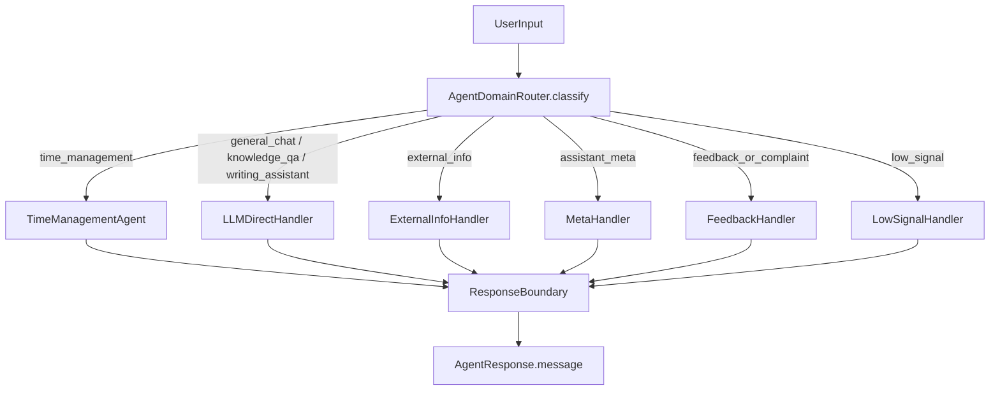

# V3.6.1 实施 Plan：Personal Agent Router + Domain 分发

## 背景与现状

当前 [src/agent/AgentService.ts](src/agent/AgentService.ts) 的 `processInput()`（L233）把 [SemanticFrameParser](src/agent/experience/SemanticFrameParser.ts) 当作入口分类器：任何非空、未命中时间管理规则的输入都会被 `detectGoal` 判为 `unsupported_intent`（L69），写作 / 知识问答 / 天气都被错误地塞进时间管理链路并 fallback。本计划新增真正的 domain 分发层，把时间管理链路封装为独立 agent，统一回复出口，并删除补丁化特判。

不回退原则：保留并继续使用 `ConversationContextBuilder`、`ResponseComposer`、`AgentTrace`、`refreshHints`、`ToolRouter`、Service/Repository 分层、`ConfirmationService`、`ExecutionVerifier`（占位）。不大搬目录、不改 DB schema。

## 目标架构

所有 handler 返回结构化结果，最终文本一律经 `ResponseBoundary` 产出，禁止泄露 tool / action / internal 名。

---

## Phase 1: Domain 类型 + ResponseBoundary 基座

**Objective**：先建立类型与统一出口，后续 Phase 可直接复用，且不改变现有行为。

**Tasks**

- Task 1.1
  - Action：新增 `AgentDomain`、`AgentRouteResult`、`AgentHandlerResult` 类型
  - Target File / Module：[src/agent/types.ts](src/agent/types.ts)
  - Notes：`AgentDomain = "time_management" | "general_chat" | "knowledge_qa" | "writing_assistant" | "external_info" | "assistant_meta" | "feedback_or_complaint" | "low_signal"`。`AgentRouteResult` 含 `domain`、`confidence`、`matchedRule?`、`rawInput`。`AgentHandlerResult` 统一 handler 输出：`{ message?, responseKind?, toolResults?, refreshHints?, metadata?, trace? }`，最终文本由 boundary 生成。扩展 `AgentTrace.planner` 增加 `"router"`，`AgentTrace` 增加可选 `domain?: AgentDomain`。
  - Priority：P0

- Task 1.2
  - Action：扩展 `ResponseKind` 与 domain-level 回复，新增 `ResponseBoundary` 作为统一出口
  - Target File / Module：[src/agent/experience/ResponseComposer.ts](src/agent/experience/ResponseComposer.ts)、新增 `src/agent/experience/ResponseBoundary.ts`
  - Notes：`ResponseKind` 增加 `general`、`knowledge_no_source`、`writing_assist`、`external_info_no_tool`、`feedback`、`low_signal`、`meta_identity`。`ResponseBoundary.finalize(input)` 接收 handler 结果（domain + responseKind + 可选已生成 message），统一裁剪并保证不含内部名；内部委托 `ResponseComposer`。`ResponseBoundary` 是唯一对 chat 正文负责的出口，`AgentService` 与各 handler 都调用它。
  - Priority：P0

- Task 1.3
  - Action：拆分 `general_chat` 与 `unsupported_intent` 的回复，删除两者复用同一句 fallback
  - Target File / Module：[src/agent/experience/ResponseComposer.ts](src/agent/experience/ResponseComposer.ts)（L47-49）
  - Notes：`general` 给轻量自然回应；`unsupported_intent` 保留能力边界提示；二者文案不同。这是 D 节要求删除的复用点。
  - Priority：P0

---

## Phase 2: TimeManagementAgent 封装

**Objective**：把现有 experience pipeline 原样抽成独立 agent，不改逻辑，只换归属，保证现有 7 个测试仍绿。

**Tasks**

- Task 2.1
  - Action：新增 `TimeManagementAgent`，迁入 `processWithExperiencePipeline` 的逻辑
  - Target File / Module：新增 `src/agent/time-management/TimeManagementAgent.ts`；来源 [src/agent/AgentService.ts](src/agent/AgentService.ts)（L293-420）
  - Notes：构造时注入 `taskService`、`timeBlockService`、`scheduleService`、`router`、`logService`、`ConversationContextBuilder`、`SemanticFrameParser`、`ActionPlanner`、`ResponseComposer`。对外暴露 `handle(userInput, context, memory): Promise<AgentHandlerResult>`。短期记忆（`lastCreatedTaskId` 等）的读写迁入本类或通过 memory 快照传递，保持与 `AgentService.trackLastEntities` / `updateExperienceMemory` 等价行为。
  - Priority：P0

- Task 2.2
  - Action：`AgentService` 改为持有 `TimeManagementAgent` 实例并委托
  - Target File / Module：[src/agent/AgentService.ts](src/agent/AgentService.ts)
  - Notes：暂时保留 `processInput` 旧分支，仅把 time-management 分支指向新 agent，确保行为不变后再进 Phase 3 切换为 router 分发。最终文本经 `ResponseBoundary`。
  - Priority：P0

---

## Phase 3: AgentDomainRouter + Handler 层

**Objective**：`AgentService.processInput()` 只做分发；新增规则 router 与各 handler。

**Tasks**

- Task 3.1
  - Action：新增 `AgentDomainRouter`，规则分类 8 个 domain
  - Target File / Module：新增 `src/agent/router/AgentDomainRouter.ts`
  - Notes：纯规则（正则 / 关键词），无 LLM。优先级建议：assistant_meta（你是谁/你能做什么）> external_info（天气/新闻/股价/汇率）> time_management（任务/安排/日程/时间块/“现在几点”）> feedback_or_complaint（没用/太慢/不对/投诉）> writing_assistant（写/帮我写/润色/翻译）> knowledge_qa（什么是/为什么/如何/解释）> low_signal（空白/单字符/纯标点/无意义）> general_chat（兜底）。返回 `AgentRouteResult`。
  - Priority：P0

- Task 3.2
  - Action：定义 `AgentHandler` 接口并新增 handler
  - Target File / Module：新增 `src/agent/handlers/AgentHandler.ts`、`LLMDirectHandler.ts`、`ExternalInfoHandler.ts`、`MetaHandler.ts`、`FeedbackHandler.ts`、`LowSignalHandler.ts`
  - Notes：接口 `handle(userInput, context): Promise<AgentHandlerResult>`。`LLMDirectHandler`（覆盖 general_chat / knowledge_qa / writing_assistant，P0）：若 LLM enabled 且有 API key，用现有 [LLMPlanner](src/agent/LLMPlanner.ts)/[DeepSeekClient](src/agent/llm/DeepSeekClient.ts) 取自然回复文本；否则优雅降级为对应 `responseKind` 的 boundary 文案。`ExternalInfoHandler`（P0）：无外部工具，诚实回复“暂不能联网获取实时信息”，给出可做的事，走 `external_info_no_tool`。`MetaHandler`（P1）：身份/能力回答，走 `meta_identity`。`FeedbackHandler`（P1）：致歉 + 引导，走 `feedback`。`LowSignalHandler`（P0）：引导补充信息，走 `low_signal`。所有 handler 都不直接拼最终文本，交给 `ResponseBoundary`。
  - Priority：P0 / P1（见各项）

- Task 3.2a（硬约束）
  - Action：在类型与构造层面强制 `LLMDirectHandler` 只读、不可写库
  - Target File / Module：新增 `src/agent/handlers/LLMDirectHandler.ts`、[src/agent/handlers/AgentHandler.ts]、[src/agent/AgentService.ts](src/agent/AgentService.ts)
  - Notes：general_chat / knowledge_qa / writing_assistant **只能生成自然语言**，硬约束为：(1) `LLMDirectHandler` 构造时不注入 `ToolRouter` / 任何写库 Service（`TaskService` / `TimeBlockService` / `ScheduleService`），从源头杜绝写操作能力；(2) 即使 LLM 返回 `tool_plan`，handler 也只取其文本字段，丢弃 `toolName` / `params`，不调用 `router.execute`，不创建任务、不修改 TimeBlock；(3) `AgentHandlerResult` 对这些 domain 不允许携带 `refreshHints`（无写操作即无需刷新）。仅 `TimeManagementAgent` 拥有写库工具入口。在 Phase 7 gold 测试中对这三类 domain 断言 `tasks`/`blocks` 数量不变。
  - Priority：P0

- Task 3.3
  - Action：重写 `AgentService.processInput()` 为 router → handler 分发
  - Target File / Module：[src/agent/AgentService.ts](src/agent/AgentService.ts)（L233-289）
  - Notes：`build context` → `router.classify()` → 选 handler（time_management 走 `TimeManagementAgent`）→ `ResponseBoundary.finalize()` → 写 `AgentTrace`（含 `domain`）与 metadata。保留 `actionLogService` 记录与 `refreshHints` 透传。
  - Priority：P0

---

## Phase 4: SemanticFrameParser 收窄 + 补丁清理

**Objective**：让 `SemanticFrameParser` 只做时间管理域内语义解析，删除测试句特判。

**Tasks**

- Task 4.1
  - Action：移除全局 domain 分类职责
  - Target File / Module：[src/agent/experience/SemanticFrameParser.ts](src/agent/experience/SemanticFrameParser.ts)（`detectGoal` L43-71）
  - Notes：删除“非空即 `unsupported_intent`”兜底；domain 已由 router 决定。`SemanticUserGoal` 收敛为时间管理内意图（`ask_current_time`、`create_and_schedule_task`、`query_schedule` 等）。greeting/identity/general_chat 不再由它判定。
  - Priority：P0

- Task 4.2
  - Action：删除“临时 + 写作任务”硬编码，改为通用标题抽取
  - Target File / Module：[src/agent/experience/SemanticFrameParser.ts](src/agent/experience/SemanticFrameParser.ts)（`extractTitle` L90-93、`extractKeyword` L114-115）
  - Notes：用通用规则抽取“……任务”标题与关键词，不针对“写作任务”单句 if。`category` 的“写作”判定可保留为通用 category 提示，但不得作为标题分支。极小指代 resolver（“刚刚/这个”）后续移入 `UniversalReferenceResolver`（V3.6.2），本期仅保留现有最小行为。
  - Priority：P0

- Task 4.3
  - Action：清理 `AgentService` 中不可达的 LLM disabled / api_key 错误块
  - Target File / Module：[src/agent/AgentService.ts](src/agent/AgentService.ts)（L259-285）
  - Notes：该 block 在前置 if 已 return 后逻辑不可达（D 节指出）。随 Phase 3 重写一并删除或重排；`processWithLLM` 的语义降级能力迁入 `LLMDirectHandler`。`processWithRules`（deprecated，L607）确认无引用后删除。
  - Priority：P0

---

## Phase 5: 最小推荐排程（职责分离）

**Objective**：补足“缺时间/时长时给推荐或追问”，保留“从现在开始”精确排程。关键：`ActionPlanner` 只做路由决策，不计算空闲时间、不生成推荐理由；真正的推荐逻辑放到独立 scheduling 模块，便于后续接 `MemoryProvider` / `RagPlanProvider` 而不污染 planner。

**职责边界**

- `ActionPlanner`（决策器，不是大脑）：只判断下一步是哪种 outcome —
  - 明确时间 → `exact_schedule`（直接 tool call）
  - 模糊时间 → `request_recommendation`（委托 scheduling 模块）
  - 删除 / 高风险 → `confirmation`
  - 它**不**自己算 free slot、**不**生成推荐文案 / 理由。
- `AvailabilityProvider` / `RecommendationPlanner` / `SchedulingReasoner`：承载全部推荐计算与理由生成。

**Tasks**

- Task 5.1
  - Action：`ActionPlanner` 只输出排程意图分类，不内联推荐计算
  - Target File / Module：[src/agent/experience/ActionPlanner.ts](src/agent/experience/ActionPlanner.ts)（L39-61）
  - Notes：保留 `start_now`（“从现在开始”）→ `exact_schedule`，禁止走推荐。缺明确开始时间且无 `start_now` 时，`ActionPlanner` 仅产出 `kind: "request_recommendation"`（或现有 plan 上标记 `needsRecommendation`），把任务标题 / 时长 / 约束传给下游；**不在此文件内调用 `get_free_slots` / 计算候选 / 写推荐理由**。缺时长用默认 30 分钟仅作为参数透传。不破坏现有“创建并排程”测试。
  - Priority：P0

- Task 5.2
  - Action：新增推荐排程模块，承载全部计算与理由
  - Target File / Module：新增 `src/agent/time-management/scheduling/AvailabilityProvider.ts`、`RecommendationPlanner.ts`、`SchedulingReasoner.ts`（可选 `SchedulingContextCollector.ts`）
  - Notes：`AvailabilityProvider` 复用 `timeBlockService.getBlocksForDate` + 现有 `get_free_slots` / `detect_conflicts` 算可用时段；`RecommendationPlanner` 据此产出 1-3 个候选；`SchedulingReasoner` 生成推荐理由 / 排序（本期可最小化为规则）。由 `TimeManagementAgent` 在收到 `request_recommendation` 时调用这些模块，而非 `ActionPlanner`。预留 `MemoryProvider` / `RagPlanProvider` 注入位（接口占位，不实现）。不接 RAG / Memory / LangChain / LangGraph。
  - Priority：P1

- Task 5.3
  - Action：`ActionPlanner` 据推荐结果决定 outcome（proposal / confirmation / tool call）
  - Target File / Module：[src/agent/experience/ActionPlanner.ts](src/agent/experience/ActionPlanner.ts)、`src/agent/time-management/TimeManagementAgent.ts`
  - Notes：候选生成后回到决策层：单一明确候选 → 可直接 tool call 或轻确认；多候选 → proposal（沿用 `PlanProposal` / `PlanOption` 结构）；高风险 → confirmation。`ActionPlanner` 只消费推荐结果做分支，不重新计算时段。
  - Priority：P1

- Task 5.4
  - Action：推荐 / proposal 结果经 ResponseBoundary 输出自然语言
  - Target File / Module：[src/agent/experience/ResponseComposer.ts](src/agent/experience/ResponseComposer.ts)、`ResponseBoundary.ts`
  - Notes：推荐文案如“我建议安排到 X–Y，需要我这样排吗？”，不出现工具名。
  - Priority：P1

---

## Phase 6: 出口统一与 UI / 错误路径清理

**Objective**：保证所有用户可见消息（含错误）经 ResponseBoundary；trace 标签降级 dev-only。

**Tasks**

- Task 6.1
  - Action：`chatStore` 错误路径统一走 boundary
  - Target File / Module：[src/store/chatStore.ts](src/store/chatStore.ts)（catch L193-205）
  - Notes：`处理失败: ${e}` 直接拼接绕过 boundary，改为由 `AgentService` 返回经 boundary 的错误 response，或在 store 调用统一错误 composer。不向用户暴露原始异常字符串。
  - Priority：P0

- Task 6.2
  - Action：AgentTrace UI 标签降级为 dev-only
  - Target File / Module：[src/components/chat/ChatMessage.tsx](src/components/chat/ChatMessage.tsx)（L111-139、MODE_LABEL/ERROR_KIND_LABEL）
  - Notes：mode / errorKind 标签用 `import.meta.env.DEV` 守卫或隐藏到 debug panel，不作为用户可见标签。气泡正文不变。
  - Priority：P1

---

## Phase 7: Gold Test Set + 验证

**Objective**：Gold Test Set 通过，fallback 与 general_chat 处理正确。

**Tasks**

- Task 7.1
  - Action：修正“帮我写一首诗”用例定位
  - Target File / Module：[src/agent/experience/__tests__/v3_6_1_pipeline.test.ts](src/agent/experience/__tests__/v3_6_1_pipeline.test.ts)（L229-242）
  - Notes：不再断言 `unsupported`，改为 writing_assistant / general direct response（经 boundary、无内部名）。保留 7 个 skeleton 中合理部分（时间、创建排程、查询安排、greeting、identity）。
  - Priority：P0

- Task 7.2
  - Action：新增 Gold Test Set 覆盖 8 个 domain + fallback + general_chat
  - Target File / Module：新增 `src/agent/__tests__/agent_router_gold.test.ts`（及按需 router/handler 单测）
  - Notes：≥16 条，覆盖 time_management（现在几点 / 创建并排程 / 查询安排 / 推荐排程）、general_chat、knowledge_qa、writing_assistant、external_info、assistant_meta、feedback_or_complaint、low_signal。统一断言 `expectNoInternalNames`。LLM 相关用 mock，不真实联网。注：审计提到“你列的 16 条”原始清单不在仓库中，本期以 8 domain 代表性用例覆盖，落地前可与你核对具体 16 句。
  - Priority：P0

- Task 7.3
  - Action：运行验证
  - Target File / Module：命令行
  - Notes：依次 `pnpm.cmd exec tsc --noEmit`、`pnpm.cmd test`、`pnpm.cmd build` 全绿。
  - Priority：P0

---

## 保留清单（不动）

- `ConversationContextBuilder`、`ResponseComposer`（扩展非重写）、`AgentTrace`、`refreshHints`、`ToolRouter`、Service/Repository 分层、`ConfirmationService`+`CONFIRMATION_POLICY`（后续包装为 `ConfirmationPolicy`）、`get_free_slots`/`detect_conflicts`。

## 不做（本期边界）

- 不接 RAG / Memory / LangChain / LangGraph / 外部工具；不全量重构；不改 DB schema；`UniversalReferenceResolver`、多候选 clarification、完整 `ExecutionVerifier` / diagnose 留待 V3.6.2 / V3.6.3。