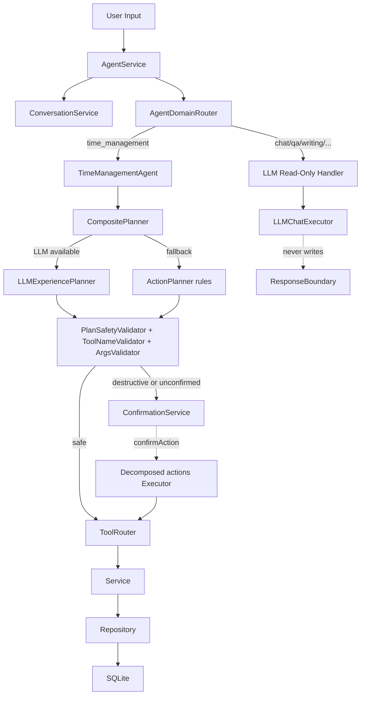

# V3.7 Integration Freeze 实施计划

## 1. 目标与范围

| 目标 | 验收口径 |
|---|---|
| LLM-first time_management planner，规则路径降级为 fallback | LLM 可用时 `TimeManagementAgent` 走 LLM 主路；`VITE_LLM_AGENT_ENABLED=false` / key 缺失 / parse_error 时自动降级到 `ActionPlanner` 并写入 `agentTrace.errorKind` |
| LLM 输出走完整安全边界 | schema → toolName → args → policy → confirmation → ToolRouter → Service |
| batch_action / defer_task 真正可执行 | 创建 confirmation 时已携带 decomposed `actions[]`，`confirmAction()` 按序执行并写日志 |
| `chatStore` 不再直连 SQLite | 新增 `ConversationService`，store 仅依赖 service |
| `VITE_LLM_AGENT_ENABLED` 总开关保留，缺 key 时不崩溃 | dev/test 无 key 也可启动，UI 给出明确提示，rule fallback 仍可用 |
| 版本语义不再混淆 | `reports/*` 和 `docs/V*` 加 `Agent Track` 标识，新建 `V3.7_IMPLEMENTATION_PLAN.md` / `V3.7_CLOSURE_REPORT.md` |
| 既有 75 条测试全绿 + 新增 LLM 安全边界测试 | `pnpm.cmd exec tsc --noEmit` 通过，`pnpm.cmd test` 通过，新增测试 ≥ 12 条 |

明确不在 V3.7 范围内：真实 RAG / 向量库、LangGraph、OCR / 日程导入、Plan Mode UI、ReferenceResolver 重构、Memory 生产化。

---

## 2. 关键架构决策（C- 方案）

- **PlannerPort** 不变签名，但 `AgentService` 注入 `CompositePlanner` 同时持有 LLM planner 与 rule planner。
- **SemanticFrameParser** 仍执行（轻量、确定性，用于 metadata / trace / response composition）；不再决定动作。
- **LLM 输出新 schema** `LLMExperiencePlanResponse`：直接产出 `ExperienceActionPlan.kind`（含 `tool / query_schedule / request_recommendation / batch_action / defer_task / direct_response / chat`）。
- **代码层强制安全**：`PlanSafetyValidator` 是唯一闸门，LLM 与 rule planner 都必经。
- **Skill 文件**：`src/agent/skills/timeManagementSkill.md`，由 `prompts.ts` 通过 `import skill from "...?raw"` 注入 system prompt。

---

## 3. 实施阶段

### Phase A — Safety Plumbing（修栅栏，不接 LLM）

阶段目标：让 batch/defer 真闭环、ConfirmationPolicy 统一、ConversationService 落地。完成后跑通既有 75 测试。

A1. 新增 [src/services/ConversationService.ts](src/services/ConversationService.ts)
- 封装 `IConversationRepository`，方法：`createMessage / loadRecent / clearAll`
- [src/store/chatStore.ts](src/store/chatStore.ts) 把 `new SqliteConversationRepository()` 改成 `new ConversationService()` 注入；不直接 import repository

A2. 新增 [src/agent/validators/PlanSafetyValidator.ts](src/agent/validators/PlanSafetyValidator.ts)
- 输入：`ExperienceActionPlan` + `ToolRouter`
- 校验项：
  - `kind === "tool"` 时 `toolName` 必须存在
  - destructive intents 强制 `requiresConfirmation = true`
  - `riskLevel` 与 `CONFIRMATION_POLICY[intent]` 取最大值
  - `kind === "batch_action" | "defer_task"` 必须携带 decomposed `actions: SinglePlanAction[]`
- 输出：`{ ok: true, plan: ExperienceActionPlan } | { ok: false, reason }`

A3. 扩展 `ExperienceActionPlan` 类型 [src/agent/types.ts](src/agent/types.ts)
- 给 `batch_action` / `defer_task` 增加可选 `params.actions?: SinglePlanAction[]`（结构与 `PlanOption.actions` 对齐，避免再造一份）
- `SinglePlanAction` 提升为顶层导出类型供 validator/executor 共用

A4. 改造 [src/agent/experience/ActionPlanner.ts](src/agent/experience/ActionPlanner.ts)
- `batch_delete_tasks` 分支：在生成 plan 时通过 `taskService` 查 `dateRange` 内的 task，写入 `params.actions = [{toolName:"delete_task", params:{taskId,title}}, ...]`
- `defer_task` 分支：根据 `targetTime` 是否存在生成 `update_time_block` 或 `schedule_task` 单个 action

A5. [src/agent/time-management/TimeManagementAgent.ts](src/agent/time-management/TimeManagementAgent.ts)
- `actionPlan` 拿到后，无论来自哪个 planner 都过 `PlanSafetyValidator.validate(plan)`；不通过则记录 `errorKind: "policy_upgraded"` 或 `"invalid_tool"` 走兜底
- `batch_action` / `defer_task` 分支创建 confirmation 时把 `actions` 一同序列化进 `tool_args_json.actions`（保持 `tool_name` 字段为 `"batch_action"` / `"defer_task"` 作为路由 hint）

A6. 改造 [src/agent/AgentService.ts](src/agent/AgentService.ts) 的 `confirmAction()`
- 解析 `args`，若包含 `actions[]` 走 `executeActionList(actions, log)`，否则走原 `router.execute(tool_name, args)` 路径
- `executeActionList` 中：
  - 逐个 action 执行 `router.execute(action.toolName, action.params)`
  - 失败：记 `logFailure`，继续后续 action（或可选 short-circuit，V3.7 默认 short-circuit）
  - 全部成功才返回 success；汇总 refreshHints
- 写入 `AgentTrace.toolResults` 数组

A7. 验收
- `pnpm.cmd exec tsc --noEmit` 通过
- `pnpm.cmd test` 现有 75 测试全绿
- 新增 unit：
  - `agent_v4_multiday.test.ts` 已断言 reject 后 0 写入；新增 confirm 后正确删除多个 task 的断言
  - `defer_task` confirm 后 `update_time_block` 真实生效

---

### Phase B — LLM Plumbing & Skill 化

B1. 新增 [src/agent/skills/timeManagementSkill.md](src/agent/skills/timeManagementSkill.md)
- 把现 [src/agent/llm/prompts.ts](src/agent/llm/prompts.ts) 的 `TOOL_DESCRIPTIONS` + 模糊语义判断（"刚刚那个任务"、"延期"、"批量删除"、`start_now` vs `absolute` 等）以中文规则形式写入
- 涵盖：tool 选择策略、模糊引用处理、何时 clarification、何时 confirmation、defer/skip/delete 区分
- **不**包含安全终判（安全终判由代码层 Validator 执行，prompt 不背锅）

B2. 重写 [src/agent/llm/prompts.ts](src/agent/llm/prompts.ts)
- `buildSystemPrompt(currentDateTime)` 改为读取 skill markdown（`import skillContent from "@/agent/skills/timeManagementSkill.md?raw"`），拼上动态时间 + 新输出 schema + 安全规则
- vite 默认支持 `?raw` 导入，无需额外插件

B3. 新增 [src/agent/llm/experienceSchemas.ts](src/agent/llm/experienceSchemas.ts)
- 定义 `LLMExperiencePlanResponse` Zod schema，字段对齐 `ExperienceActionPlan`：
  - `kind: "tool" | "query_schedule" | "request_recommendation" | "batch_action" | "defer_task" | "direct_response" | "chat" | "clarification" | "unsupported"`
  - `userGoal: SemanticUserGoal`
  - `toolName?: string`
  - `params: Record<string, unknown>`
  - `summary: string`
  - `clarifyingQuestion?: string`
  - `confidence: number`
  - `actions?: SinglePlanAction[]`（batch/defer 必填）
- 复用 `extractJSON` / `parseLLMResponse` 风格

B4. 新增 [src/agent/llm/LLMExperiencePlanner.ts](src/agent/llm/LLMExperiencePlanner.ts) `implements PlannerPort`
- 入参 `(frame, context)` —— 这里 `frame` 是 `SemanticFrameParser` 仍然产出的轻量结构（用于上下文 / metadata，但 LLM 不被它约束）
- 内部调用 `LLMClient.chat()`，使用 B2 prompt + `formatContextBlock(...)`
- 返回前调用 `PlanSafetyValidator`；失败则抛 `LLMPlanInvalidError`（携带原因）
- API key 缺失 / 网络错误 / parse_error / schema invalid → 抛 `LLMUnavailableError`（携带 `errorKind`）
- 不直接走 ToolRouter

B5. 新增 [src/agent/CompositePlanner.ts](src/agent/CompositePlanner.ts) `implements PlannerPort`
- 持有 `llmPlanner: LLMExperiencePlanner | undefined` + `fallback: ActionPlanner`
- `plan(frame, context)`：
  - 若 `llmPlanner.isAvailable()` → try `llmPlanner.plan`；失败/抛错则走 fallback，将 `errorKind` 与 `plannerUsed: "fallback"` 写入 context 旁路（通过 mutable trace handle 或 AgentService 重新解析）
  - 否则直接走 fallback
- 暴露 `lastUsedPlanner: "llm" | "rule"` 供 `TimeManagementAgent` 写入 `AgentTrace.planner`

B6. 改造 [src/agent/AgentService.ts](src/agent/AgentService.ts) 构造器
- 新增 `options.llmClient?: LLMClient`
- 默认逻辑：`options.llmClient ?? (VITE_LLM_AGENT_ENABLED ? new DeepSeekClient() : undefined)`
- 用 client 构造 `LLMExperiencePlanner` 与 `CompositePlanner`，把 `CompositePlanner` 作为 `plannerPort` 传入 `TimeManagementAgent`
- 若 client 不可用：composite 仅含 fallback，行为等价当前实现

B7. 改造 [src/agent/time-management/TimeManagementAgent.ts](src/agent/time-management/TimeManagementAgent.ts)
- 把 `agentTrace.planner` 改为读取 composite 的 `lastUsedPlanner`
- 若 plan 被 PlanSafetyValidator reject：返回 `errorKind: "policy_upgraded" | "invalid_tool"` 兜底响应，不执行

B8. 验收
- API key 缺失（默认 dev）→ 所有 time_management 走规则路径，75 测试不动
- 注入 `MockLLMClient` → time_management 走 LLM 路径

---

### Phase C — 只读 Handler 接入 LLM

C1. 新增 [src/agent/llm/LLMChatExecutor.ts](src/agent/llm/LLMChatExecutor.ts)
- 输入：`domain` + `userInput` + `recentMessages`
- 内部调用 `LLMClient.chat()`，使用专为 chat/qa/writing 的精简 system prompt（无 tool 列表，强调"只回复文本，不能执行任何操作"）
- 返回 `string`（已 trim）；失败抛错

C2. 改造 [src/agent/handlers/LLMDirectHandler.ts](src/agent/handlers/LLMDirectHandler.ts)
- 构造器接受可选 `llmExecutor?: LLMChatExecutor`
- 若 executor 可用 → 调用获取真实文本，作为 `AgentHandlerResult.message` 返回；同时设 `responseKind: "general" | "knowledge_no_source" | "writing_assist"` 用于 ResponseBoundary 兜底
- 若不可用 / 调用失败 → 退回当前 hard-coded boundary
- 严格不调用任何 `ToolRouter` / `Service`

C3. [src/agent/AgentService.ts](src/agent/AgentService.ts) 把 `LLMChatExecutor` 注入 `LLMDirectHandler` / `ExternalInfoHandler` / `FeedbackHandler`（后两者按需，可在 C 阶段最小只接 `LLMDirectHandler`）

C4. ResponseBoundary 保留兜底；LLM 文本仍走 `ResponseBoundary.finalize` 以剥离 JSON / 内部名

---

### Phase D — 测试与 Mock Harness

D1. 新增 [src/agent/testing/MockLLMClient.ts](src/agent/testing/MockLLMClient.ts)
- 构造 `new MockLLMClient(scripts: Array<{ matcher: RegExp | string, response: LLMExperiencePlanResponse | LLMError }>)`
- 实现 `LLMClient` 接口；`chat()` 返回 JSON.stringify(response) 或 throw

D2. 扩展 [src/agent/testing/createMockAgentHarness.ts](src/agent/testing/createMockAgentHarness.ts)
- 新增可选参数 `llmClient?: LLMClient`；默认不传（保持现有 75 测试规则路径）
- 暴露便捷构造：`createMockAgentHarnessWithLLM(scripts)`

D3. 新增 [src/agent/__tests__/agent_v3_7_llm_safety.test.ts](src/agent/__tests__/agent_v3_7_llm_safety.test.ts)（≥ 12 条）
- LLM tool_plan happy path → ToolRouter 执行成功
- LLM 返回未注册 toolName → reject，0 写入，trace.errorKind=`invalid_tool`
- LLM 返回 destructive intent 但 `requiresConfirmation=false` → 被 policy 强制升级
- LLM 返回 batch_action 但无 `actions[]` → reject
- LLM 返回 batch_action 含 `actions[]` → confirm 后顺序执行全部
- LLM 返回 defer_task → 分解为 `update_time_block`，confirm 后真实生效
- LLM 抛 `api_key_missing` → 降级 fallback，metadata.errorKind 正确
- LLM 抛 `network_error` → 降级 fallback
- LLM 返回非 JSON → parse_error 降级
- LLM args 缺少必填字段 → reject
- LLM tool_plan 中 toolName 与 intent CONFIRMATION_POLICY 冲突 → 以 policy 为准
- Read-only handler 经 LLMChatExecutor 返回文本 → 不写库，不调 ToolRouter

D4. 新增 [src/services/__tests__/ConversationService.test.ts](src/services/__tests__/ConversationService.test.ts)
- 基础 CRUD smoke
- chatStore 改造后是否仍兼容历史 message metadata 解析

D5. Phase A 新增的 batch/defer confirm-then-execute 断言加到 [src/agent/__tests__/agent_v4_multiday.test.ts](src/agent/__tests__/agent_v4_multiday.test.ts)（不新建文件，加 it 块）

---

### Phase E — 文档 / 版本语义清理

E1. 新增 [reports/V3.7_IMPLEMENTATION_PLAN.md](reports/V3.7_IMPLEMENTATION_PLAN.md)（沿用现有 V3/V4/V5 报告结构）

E2. 完成后写 [reports/V3.7_CLOSURE_REPORT.md](reports/V3.7_CLOSURE_REPORT.md)

E3. 在 [reports/V3_IMPLEMENTATION_PLAN.md](reports/V3_IMPLEMENTATION_PLAN.md) / `V4_*` / `V5_*` 头部加一行 `> **Agent Track Version** — 不等于 Product V3/V4/V5`

E4. 更新 [docs/ROADMAP_REBASE_AFTER_AGENT_V5.md](docs/ROADMAP_REBASE_AFTER_AGENT_V5.md) §5：把 "LLM 主路决策" 标为 **DONE → 选定方案 C-**，并附本计划链接

E5. 更新 [.env.example](.env.example)：澄清 `VITE_LLM_AGENT_ENABLED=true` 时若缺 key 行为如何（不崩溃，降级 + UI 提示）

---

## 4. 文件改动清单（最终交付）

新增文件：
- `src/services/ConversationService.ts`
- `src/agent/validators/PlanSafetyValidator.ts`
- `src/agent/skills/timeManagementSkill.md`
- `src/agent/llm/experienceSchemas.ts`
- `src/agent/llm/LLMExperiencePlanner.ts`
- `src/agent/llm/LLMChatExecutor.ts`
- `src/agent/CompositePlanner.ts`
- `src/agent/testing/MockLLMClient.ts`
- `src/agent/__tests__/agent_v3_7_llm_safety.test.ts`
- `src/services/__tests__/ConversationService.test.ts`
- `reports/V3.7_IMPLEMENTATION_PLAN.md`
- `reports/V3.7_CLOSURE_REPORT.md`（V3.7 完成时写）

修改文件：
- [src/agent/AgentService.ts](src/agent/AgentService.ts) — 注入 LLM client、CompositePlanner、batch/defer 执行闭环
- [src/agent/time-management/TimeManagementAgent.ts](src/agent/time-management/TimeManagementAgent.ts) — 写入 plannerUsed、过 PlanSafetyValidator
- [src/agent/experience/ActionPlanner.ts](src/agent/experience/ActionPlanner.ts) — batch_delete / defer 分解 actions
- [src/agent/types.ts](src/agent/types.ts) — 导出 SinglePlanAction、补 actions 字段
- [src/agent/handlers/LLMDirectHandler.ts](src/agent/handlers/LLMDirectHandler.ts) — 接 LLMChatExecutor
- [src/agent/llm/prompts.ts](src/agent/llm/prompts.ts) — 改为读取 skill md
- [src/store/chatStore.ts](src/store/chatStore.ts) — 依赖 ConversationService
- [src/agent/testing/createMockAgentHarness.ts](src/agent/testing/createMockAgentHarness.ts) — 可选 llmClient
- [src/agent/__tests__/agent_v4_multiday.test.ts](src/agent/__tests__/agent_v4_multiday.test.ts) — 新增 confirm-then-execute 断言
- [.env.example](.env.example) — 行为澄清
- 各 reports + roadmap 头部标注

---

## 5. 风险与缓解

| 风险 | 缓解 |
|---|---|
| LLM 输出 schema 偏离 `ExperienceActionPlan.kind` | 在 prompt 中给出严格 JSON 例子；Zod schema 强校验；失败直接降级，不让用户感知 |
| 现有 75 测试因 SemanticFrameParser 路径被改动而崩 | Phase A 不动 LLM；Phase B 通过 CompositePlanner 走 fallback；测试默认 `llmClient = undefined` |
| `?raw` markdown 导入在 vitest 下需配置 | vitest 4 + vite 6 默认支持；如有问题 fallback 用 fs.readFileSync 注释掉 hash 路径或写入 `vite.config.ts` |
| DeepSeek 在 Tauri WebView 下 CORS 失败 | [src/agent/llm/DeepSeekClient.ts](src/agent/llm/DeepSeekClient.ts) 已留 TODO；V3.7 先在 dev 模式验证，Tauri 真机路径作为 V3.7.1 子任务（不阻塞 freeze） |
| batch_delete actions 数量大时 short-circuit 半执行 | confirm-then-execute 全程逐条写 ActionLog；失败 short-circuit + 在响应中明确已成功 N / 待执行 M |
| Skill md 与 TOOL 列表漂移 | 在 `PlanSafetyValidator` 与单测中校验所有 toolName 在 router 注册表；CI 跑 `pnpm test` 即可发现 |

---

## 6. 退出标准 (Definition of Done)

- `pnpm.cmd exec tsc --noEmit` 通过
- `pnpm.cmd test` 通过；新增 ≥ 12 条 LLM 安全边界测试；旧 75 条全绿
- LLM 启用 + 配 key → 自然语言新建/查询/删除/批量/延期端到端走通，destructive 全部进 confirmation
- LLM 关闭 / 缺 key → 应用启动正常，规则路径功能等价当前实现
- `chatStore` 不再 `import "SqliteConversationRepository"`
- `git grep "batch_action\|defer_task"` 不再出现"创建 confirmation 但无对应 Tool"的注释
- `reports/V3.7_CLOSURE_REPORT.md` 完成
- `docs/ROADMAP_REBASE_AFTER_AGENT_V5.md` P0 表中 LLM 主路决策 / batch-defer / ConversationService / 版本文档重命名标记为 DONE