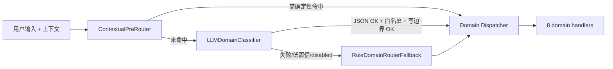
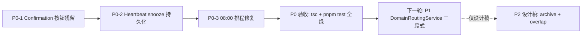

# Agent Domain Routing & UX Hotfix Audit (V3.7)

> 本轮范围：**只执行 P0**（confirmation → Heartbeat → 08:00），P1 / P2 提前完成审计 + 设计但不动手。

---

## A. Agent Domain Routing Audit（P1 设计，本轮不实现）

### A.1 Current Domain Map

8 个 domain，对应 handler 全部为 read-only（除 `time_management`）：

- `time_management` → `TimeManagementAgent`（唯一允许通过 ToolRouter 写入）
- `assistant_meta` → `MetaHandler`（read-only，固定 `responseKind=meta_identity`）
- `general_chat` → `LLMDirectHandler("general_chat")`
- `knowledge_qa` → `LLMDirectHandler("knowledge_qa")`
- `writing_assistant` → `LLMDirectHandler("writing_assistant")`
- `external_info` → `ExternalInfoHandler`
- `feedback_or_complaint` → `FeedbackHandler`
- `low_signal` → `LowSignalHandler`

入口：`[src/agent/router/AgentDomainRouter.ts](src/agent/router/AgentDomainRouter.ts)` `detectDomain()`，规则按顺序短路。

### A.2 Write Boundary（不变）


| Domain          | 允许写 Task / TimeBlock / DB | 路径                                   |
| --------------- | ------------------------- | ------------------------------------ |
| time_management | 是                         | 走 ToolRouter / Tool / Service，确认链路完整 |
| 其余 7 个          | 否                         | 物理上不引用 ToolRouter                    |


### A.3 Ambiguous Input Classes（重点矛盾）

1. **assistant_meta vs general_chat**：当前 meta 正则只覆盖 "你是谁/你能做什么"。"你是什么模型？" "你能联网吗？" 等被误判为 general_chat。
2. **app_help**："这个应用怎么用？""你能导入课表吗？" → 当前归 general_chat。
3. **low_signal vs general_chat / pending confirmation**："嗯/好/随便/ok/确认/取消" 当前都走 general_chat 兜底。**关键：当存在 pending confirmation/clarification 时，"好/ok/确认" 应转为 confirm 操作，"取消/不"应转为 reject，绝不能落 low_signal**。
4. **schedule_explanation vs time_management**：保留进入 time_management。
5. **external_info vs knowledge_qa**：当前顺序正确。
6. **feedback vs user complaint**：合并为 `feedback_or_complaint`，无需拆分。

### A.4 Golden Routing Cases（≥40 条）

49 条覆盖：assistant_meta、app_help、time_management、low_signal（含纯标点 + 短词）、general_chat、knowledge_qa、writing_assistant、external_info、feedback_or_complaint。**新增上下文相关 cases**：

```text
# 上下文相关（pending confirmation 存在时）
50. ctx=pending_confirm + "好" → 触发 confirmAction，不进 low_signal
51. ctx=pending_confirm + "ok" → 触发 confirmAction
52. ctx=pending_confirm + "确认" → 触发 confirmAction
53. ctx=pending_confirm + "取消" → 触发 rejectAction
54. ctx=pending_confirm + "不" → 触发 rejectAction
55. ctx=pending_clarify + "我是说写文档" → 进 time_management
56. ctx=none + "好" → low_signal（短词白名单）
```

### A.5 Current Failures

按当前 router 推演，至少 14 条会误路由（详见原审计输出）。

### A.6 Proposed Routing Architecture（**重大调整：弃用 Regex-first**）

**不再以正则作为主路由**。新增 `DomainRoutingService`，三段式：




#### A.6.1 ContextualPreRouter

**只处理高确定性状态，不调 LLM**：

- 空输入 / 纯标点（含连续标点）→ `low_signal`
- `length <= 1` 且非 `pending_`* → `low_signal`
- **pending confirmation continuation**：当 `context.pendingConfirmationId` 存在时：
  - "好/确认/可以/yes/ok/y/对/嗯" → `time_management`，自动调用 `confirmAction(pendingConfirmationId)`
  - "取消/不/不要/no/n" → `time_management`，自动调用 `rejectAction(pendingConfirmationId)`
- **pending clarification continuation**：当 `context.pendingClarification` 存在时：
  - 短回复 → 视为补充信息，进 `time_management`
- **当前流程内的 confirm/cancel/back 短回复**（同上）

输出：`{ domain, subtype, confidence: 1.0, source: "contextual" }`，未命中时返回 `null`。

#### A.6.2 LLMDomainClassifier

**主语义路由器**。仅分类，**不允许生成工具调用，不允许写数据库，不允许回答用户**。

请求约束：

- 系统提示词只描述 8 个合法 domain + 它们的语义，要求严格 JSON 输出。
- 输入：用户原文 + 当前上下文摘要（pending_confirmation/clarification 状态、最近一条 assistant 文本）。
- 输出契约：

```ts
interface DomainRoutingDecision {
  domain:
    | "time_management"
    | "assistant_meta"
    | "general_chat"
    | "knowledge_qa"
    | "writing_assistant"
    | "external_info"
    | "feedback_or_complaint"
    | "low_signal";
  subtype?: string;            // 例如 meta_model / meta_capabilities / meta_app_help
  confidence: number;          // 0..1
  requiresWrite: boolean;      // 必须为 true 才能进 time_management
  reason: string;              // 用于 trace/QA
}
```

#### A.6.3 代码侧二次校验（强制）

LLM 返回后必须经过：

1. JSON schema 校验（Zod）→ 失败 → fallback。
2. `domain` ∈ 白名单 → 否则 fallback。
3. **写边界**：若 `requiresWrite === true` 且 `domain !== "time_management"` → 视为非法，fallback。
4. `confidence < threshold`（默认 0.55）→ fallback。

#### A.6.4 RuleDomainRouterFallback

**保留现有 `AgentDomainRouter` 正则不再扩展为主路**，作为以下场景的兜底：

- `VITE_LLM_AGENT_ENABLED=false`
- API key 缺失
- LLM 网络/超时/HTTP 错误
- LLM 返回非法 JSON
- LLM 置信度过低
- LLM 返回 `requiresWrite=true` 但 domain 错配

Fallback 后端仍是 `AgentDomainRouter.classify()`。

#### A.6.5 Trace

每次路由结果写入 `AgentTrace`：

```ts
{
  planner: "router",
  domain,
  routerSource: "contextual" | "llm" | "fallback",
  llmDecision?: DomainRoutingDecision,
  fallbackReason?: string
}
```

### A.7 Implementation Plan（下一轮）

1. 新增 `src/agent/router/DomainRoutingService.ts`，注入：
  - `ContextualPreRouter`（新建）
  - `LLMDomainClassifier`（新建，复用现有 `LLMChatExecutor` 的 HTTP 客户端）
  - `RuleDomainRouterFallback`（包装现有 `AgentDomainRouter`）
2. `AgentService.processInput` 由 `domainRouter.classify` 改为 `domainRoutingService.classify(input, context)`，调用方式异步。
3. 注入点：`AgentService` 构造里默认 `new DomainRoutingService(...)`，测试可注入 mock。
4. `**MetaHandler` 子分类 + 文案修订**：
  - 子分类基于 `subtype`（来自 LLMDomainClassifier）或 fallback 的关键词匹配。
  - **文案基于配置状态如实回答**，不再写"不公开底层模型"：
    - `meta_model` → 读 `VITE_LLM_AGENT_ENABLED` 与 `VITE_LLM_MODEL` 等运行时配置：
      - 若 LLM 启用：`"我接入了 ${configuredModel || "DeepSeek-V4-Pro"} 作为语义理解层；具体来回的工具调用由本地规则引擎执行。"`
      - 若 LLM 禁用：`"当前我以本地规则引擎运行，没有调用外部 LLM。"`
    - `meta_capabilities` → 列出当前注册的工具能力（`toolRouter.list()`）。
    - `meta_app_help` → 列出主流程入口（创建任务/查询日程/Heartbeat 等），不夸大未实现的能力。

### A.8 Tests（下一轮）

- `src/agent/router/__tests__/ContextualPreRouter.test.ts` —— pending_confirm + "好/ok/确认" → time_management；无 pending → low_signal。
- `src/agent/router/__tests__/DomainRoutingService.test.ts`：
  - **MockLLMClient 固定返回 domain**，验证 dispatch 正确：
    - mock 返回 `{domain:"assistant_meta",subtype:"meta_model",confidence:0.9,requiresWrite:false}` → 进 MetaHandler
    - mock 返回 `{domain:"time_management",requiresWrite:true,confidence:0.9}` → 进 TimeManagementAgent
    - mock 返回 `{domain:"general_chat",requiresWrite:true}` → **二次校验失败 → fallback**
  - **LLM disabled** 时验证 fallback router 正确（注入 `LLMClient = null`）。
  - **read-only domains** 不允许调用 ToolRouter / Service 写入（fake ToolRouter，断言 `execute` 调用 0 次）。
  - **pending confirmation** 下"好 / ok / 确认 / 取消"不进 low_signal（断言 `confirmAction / rejectAction` 被调用）。
- 保留并扩展 `agent_router_gold.test.ts` 中现有 21 条；49 条 router-only gold 改在 mock LLM 模式下跑（`MockLLMClient` 按 expected domain 返回，验证 dispatch + boundary）。

---

## B. 问题 2–7 诊断

### B.2 默认排程到 08:00（**P0，本轮 #3**）

根因：

- `[AvailabilityProvider.zonedDayBounds](src/agent/time-management/scheduling/AvailabilityProvider.ts)` 写死 `hour: 8` 作日窗起点，slot 切片时 `cursor` 只与 `dayStart` 比较，不与 now 比较。
- `[SchedulingReasoner](src/agent/time-management/scheduling/SchedulingReasoner.ts)` 直接 `start = new Date(slot.start)`，未做 `effectiveStart = max(slot.start, now + buffer)`。
- `[TimeManagementAgent](src/agent/time-management/TimeManagementAgent.ts)` 取 `candidates[0]` 写入 confirmation，未二次裁剪。
- 现有 gold 测试只断言 hour ≥ 8，**没有断言 ≥ now**。

修法：

- `RecommendationPlanner.plan({ now, durationMinutes, timezone, ... })` 增加 `now`（透传 `context.currentDatetime`）。
- `SchedulingReasoner.rank({ slots, durationMs, now, bufferMinutes=15 })` 增加 `now` + `buffer`：
  - `effectiveStart = max(slot.start, now + buffer*60_000)`
  - 若 `slot.end - effectiveStart < durationMs` → 跳过
  - 否则 push `{ start: effectiveStart, end: effectiveStart + durationMs }`
- `AvailabilityProvider.getAvailability(...)` 在切 slot 时 `cursor = max(cursor, now)`（鲁棒性）。
- 若用户显式指定"上午/早上/8点"等 → 已进 exact 路径，不影响。

测试：

- 新增 `src/agent/time-management/scheduling/__tests__/SchedulingReasoner.test.ts` —— `vi.setSystemTime("2026-05-30T06:00:00.000Z")`（上海 14:00），空日历，duration=30 → 推荐 start ≥ now + 15min。
- 修改 `agent_router_gold.test.ts` 的 timezone 用例：`hour >= 8` → `parseISO(start) >= now + buffer`。

### B.3 已处理完成。后仍显示确认按钮（**P0，本轮 #1**）

根因：

- `[ChatMessage.tsx](src/components/chat/ChatMessage.tsx)` `confirmationId && role==='assistant'` 即渲染按钮，**不看 `metadata.resultType`**。
- `[AgentService.confirmAction / rejectAction](src/agent/AgentService.ts)` 返回的新消息 metadata 仍带 `confirmationId`（用于 trace），且 `resultType` 已是 `success / failure / rejected`。
- `[chatStore.confirmAction](src/store/chatStore.ts)` 只 append 新消息，**从不回写**老消息的 `metadata.resultType`。
- `ConversationService` 无 `updateMessageMetadata`，刷新后老消息仍显示按钮。

修法（三层一起改才彻底）：

1. **UI 层（必）**：`ChatMessage.tsx` 渲染条件改为

```ts
   const isPending =
     !!confirmationId &&
     (message.metadata?.resultType === undefined ||
      message.metadata?.resultType === "pending_confirmation");
   

```

1. **Store 内存合并（必）**：`chatStore.confirmAction / rejectAction` 在 append 新消息前，把同 `confirmationId` 的旧 assistant 消息 `metadata.resultType` patch 为 `success / failure / rejected`。
2. **持久化（建议）**：`ConversationService.updateMessageMetadata(id, patch)`，DB 层同步落盘。

测试：

- 新增 `src/store/__tests__/chatStore.confirmation.test.ts`（或 `src/components/chat/__tests__/ChatMessage.confirmation.test.tsx`）：
  - 模拟一条 pending 消息 + 一次 `confirmAction` → 断言新消息 `resultType === "success"`、旧消息 `resultType` 已 patch、按钮渲染条件返回 false。

### B.4 Heartbeat 反馈重复弹窗（**P0，本轮 #2**）

根因：

- `[heartbeatStore.closeFeedbackDialog()](src/store/heartbeatStore.ts)` 写入内存 `feedbackSnoozeUntil`，但 `stopHeartbeat()` 会清空、`persist.partialize` 不持久化。
- `[HeartbeatService.markEndPromptSent()](src/services/HeartbeatService.ts)` 已实现但**全项目无任何调用点**（dead code）。
- DB `time_blocks` 没有 `feedback_snoozed_until` 字段。
- 延长后 `end_time > now`，filter 已不会再选中——延长后仍弹通常是 store 缓存旧 block。

修法：

- 新增 migration v5：`ALTER TABLE time_blocks ADD COLUMN feedback_snoozed_until TEXT`。
- `TimeBlock` 类型加 `feedback_snoozed_until?: string`，`SqliteTimeBlockRepository` 读写。
- 新增 `TimeBlockService.snoozeFeedback(blockId, untilISO)` 写字段（不绕过 service 边界）。
- `HeartbeatService.getPendingFeedback` filter 增加 `!(b.feedback_snoozed_until && b.feedback_snoozed_until > nowStr)`。
- `ExecutionFeedbackDialog.handleDismiss` 调 `snoozeFeedback(block.id, +10min)`，不再仅写 store。
- 离开页面 `stopHeartbeat()` 不清 `feedbackSnoozeUntil` 内存值（防御）。
- 延长成功后 `await refreshBlocks()`（保证 store 拿最新 `end_time`）。
- `markEndPromptSent` 暂留 dead code。

测试：

- 新增 `src/services/__tests__/HeartbeatService.feedbackSnooze.test.ts`：
  - `snoozeFeedback(block, +10min)` → 5 分钟后 `getPendingFeedback` 返回 null
  - 11 分钟后重新返回该 block
  - extended 后 `end_time > now` → 不返回该 block

### B.5 拆分剩余任务流程（**P1，下一轮**）

现状：`[proposeEndFeedback("split")](src/agent/AgentService.ts)` 只生成 1 个 PlanOption，UI 只有"创建剩余任务"。

修法（**不污染 ToolRouter**，用 `PlanOption.uiAction` 字段而非伪 toolName）：

1. 在 `PlanOption` 类型上**新增可选字段**：

```ts
export interface PlanOption {
  // ...原字段
  uiAction?:
    | { kind: "open_schedule_dialog"; taskId?: string; defaultDurationMinutes?: number }
    | { kind: "split_then_recommend"; durationMinutes: number };
}
```

1. `proposeEndFeedback("split")` 返回 3 个 PlanOption（**不再使用 `__composite_*__` 假 tool 名**）：

```text
1. label: "仅创建剩余任务，暂不安排"
   toolName: "create_task"
   params:   { title, priority }
   uiAction: undefined

2. label: "创建剩余任务并由我推荐时间"
   toolName: "create_task"
   params:   { title, priority }
   uiAction: { kind: "split_then_recommend", durationMinutes }
   summary:  "创建剩余任务，安排到推荐时间"

3. label: "创建剩余任务，我自己选时间"
   toolName: "create_task"
   params:   { title, priority }
   uiAction: { kind: "open_schedule_dialog", defaultDurationMinutes }
```

1. `executePlanOption` 仍只走真正注册的 ToolRouter 工具：
  - 选项 1：直接 `create_task`。
  - 选项 2：执行 `create_task`，**返回结果中携带 `option.uiAction`**；UI 端在拿到 `manualScheduleHint=true` 时，调用一次 `proposeRecommendedSlot(taskId, duration)`（基于 P0 的 now+buffer 推荐），再 confirm 进 `schedule_task`。或者由 AgentService 暴露一个新方法 `splitThenRecommend(taskId, duration)`，内部串行调 `get_free_slots → schedule_task`。
  - 选项 3：执行 `create_task` 后由 UI 打开 `ScheduleTaskDialog` 预填新任务。
2. **不向 ToolRouter 注册任何虚拟工具**；`uiAction` 完全停留在 UI 层。

测试：

- `src/agent/__tests__/agent_split_remaining.test.ts`：
  - 选项 1 → tasks +1，blocks +0
  - 选项 2 → tasks +1，blocks +1，`block.start_time >= now + buffer`
  - 选项 3 → tasks +1，blocks +0；返回结果 `uiAction.kind === "open_schedule_dialog"`

### B.6 Completed 任务归档（**P2，仅出设计稿**）

现状：`Task` 表无 `archived_at` / `completed_at`；列表默认 "全部" 含 done。

设计：

- migration：`ALTER TABLE tasks ADD COLUMN archived_at TEXT`
- `Task.archived_at?: string`；`TaskFilter.excludeArchived?: boolean`（默认 true）
- `TaskService.archiveTask / unarchiveTask`
- `TodoList`：新筛选 tab "归档"；`all` 默认排除 archived
- 自动归档（可后置）：completed 超过 N 天自动写 archived_at
- 不动 `deleted_at` 语义；不引入 `completed_at`，沿用 `status='done'`

**本轮不实施**，不属于 V3.7 范围。

### B.7 Task 重叠策略（**P2，仅出设计稿**）

现状（按层级）：

- `ScheduleService.scheduleTaskToTimeBlock` — strict throw
- `TimeBlockService.createTimeBlock` — 不检
- `ScheduleTaskDialog` / `TimeBlockForm` — UI 警告 + 禁用提交
- Agent 推荐路径 — 走空闲槽，天然避开
- Agent `precheckPlanAction` — strict precheck

设计：

- `OverlapMode = "strict" | "warn" | "allow_manual"`
  - 全局默认 `strict`，存 settings
  - 单次写可覆盖：`createTimeBlock(input, { overlapMode })`
- `detectConflicts(blocks, range, options?)` 返回 `{ hasConflict, conflicts }`，不再代调用方抛错
- `ScheduleService.scheduleTaskToTimeBlock(input, { overlapMode })`：strict throw / warn return warnings / allow_manual 仅返回 warnings
- UI 在 warn 模式下不禁用提交，二次确认弹窗
- Agent 自动排程仍 strict；用户提案 create_time_block 默认 warn
- TimeBlock.type 可选差异：event/task strict，break/routine 允许重叠

**本轮不实施**，不属于 V3.7 范围。

---

## C. 分阶段实施计划




### 涉及文件总览

- 路由 / Handlers（**下一轮**）：`[src/agent/router/AgentDomainRouter.ts](src/agent/router/AgentDomainRouter.ts)`, 新建 `src/agent/router/DomainRoutingService.ts` / `ContextualPreRouter.ts` / `LLMDomainClassifier.ts`, `[src/agent/handlers/MetaHandler.ts](src/agent/handlers/MetaHandler.ts)`, `[src/agent/experience/ResponseComposer.ts](src/agent/experience/ResponseComposer.ts)`
- 排程（本轮 P0-3）：`[src/agent/time-management/scheduling/AvailabilityProvider.ts](src/agent/time-management/scheduling/AvailabilityProvider.ts)`, `[src/agent/time-management/scheduling/SchedulingReasoner.ts](src/agent/time-management/scheduling/SchedulingReasoner.ts)`, `[src/agent/time-management/scheduling/RecommendationPlanner.ts](src/agent/time-management/scheduling/RecommendationPlanner.ts)`, `[src/agent/time-management/TimeManagementAgent.ts](src/agent/time-management/TimeManagementAgent.ts)`
- 确认按钮（本轮 P0-1）：`[src/components/chat/ChatMessage.tsx](src/components/chat/ChatMessage.tsx)`, `[src/store/chatStore.ts](src/store/chatStore.ts)`, `[src/agent/AgentService.ts](src/agent/AgentService.ts)`, `[src/services/ConversationService.ts](src/services/ConversationService.ts)`
- Heartbeat（本轮 P0-2）：`[src/services/HeartbeatService.ts](src/services/HeartbeatService.ts)`, `[src/services/TimeBlockService.ts](src/services/TimeBlockService.ts)`, `[src/store/heartbeatStore.ts](src/store/heartbeatStore.ts)`, `[src/components/heartbeat/ExecutionFeedbackDialog.tsx](src/components/heartbeat/ExecutionFeedbackDialog.tsx)`, `[src/db/migrations.ts](src/db/migrations.ts)`, `[src/types/timeblock.types.ts](src/types/timeblock.types.ts)`, `[src/repositories/sqlite/SqliteTimeBlockRepository.ts](src/repositories/sqlite/SqliteTimeBlockRepository.ts)`

---

## D. P0 验收门禁

每完成一个 P0 子项，运行：

```powershell
pnpm.cmd exec tsc --noEmit
pnpm.cmd test
```

P0 全部完成后必须满足：

- 所有现有测试绿（不删旧测试，仅必要时修断言）
- 新增测试：
  - `chatStore.confirmation.test.ts`（或同等位置的 ChatMessage 确认渲染条件测试）
  - `HeartbeatService.feedbackSnooze.test.ts` 
  - `SchedulingReasoner.test.ts`
- `agent_router_gold.test.ts` 中"timezone slot ≥ 08:00" 改为 ≥ now + buffer 后仍绿
- 手测三场景：
  1. 删除任务 → 显示"确认/取消"按钮 → 点确认 → "已处理完成。" → **该消息不再有按钮**，刷新仍无
  2. 创建一条已结束 TimeBlock → 弹反馈 → 选"暂不处理" → 离开 Today → 回 Today → **10 分钟内不再弹**
  3. 当前 14:00，输入"帮我安排写文档 30 分钟" → **推荐时间不早于 14:15**

