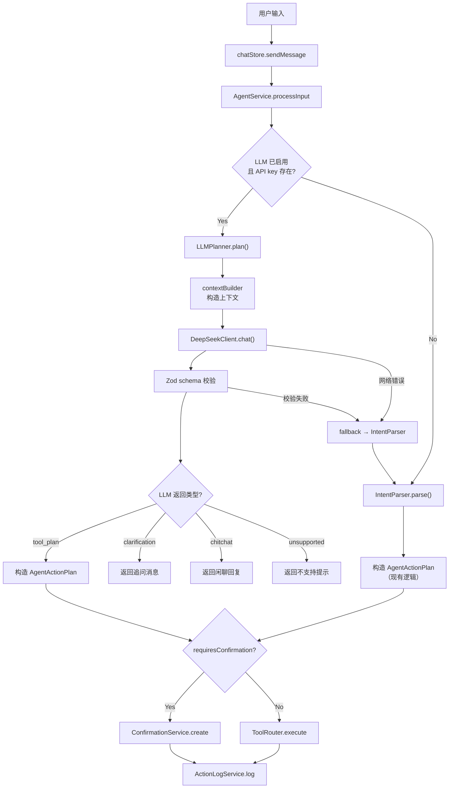

# V3 — DeepSeek LLM Agent 接入版实现计划

## 一、现状概要

- **项目技术栈**：Tauri 2 + Vite 6 + React 19 + TypeScript + SQLite + Zustand
- **V2.5 已完成**：AgentCommand / AgentActionPlan / AgentToolResult / ToolRouter / CONFIRMATION_POLICY / ActionLog / ChatMessageMetadata / 17 个 Tool
- **当前 Agent 流程**：`IntentParser.parse(regex)` → `AgentCommand` → `AgentActionPlan` → `ToolRouter.execute` → `ActionLog`
- **已有依赖**：`zod@^3.24.1`（可用于 schema 校验）；无 OpenAI SDK
- **无 `.env` 文件**：需新建 `.env.example`

## 二、新增/修改文件清单

### 新增文件（7 个）

| 文件 | 说明 |
|---|---|
| `src/agent/llm/LLMClient.ts` | 统一 LLM 接口定义（不绑定 DeepSeek） |
| `src/agent/llm/DeepSeekClient.ts` | DeepSeek API 实现（OpenAI-compatible Chat Completions） |
| `src/agent/llm/prompts.ts` | System prompt + 工具描述 |
| `src/agent/llm/schemas.ts` | LLM 输出 JSON schema（Zod 运行时校验） |
| `src/agent/llm/contextBuilder.ts` | 轻量上下文构造器（最近消息 + 今日摘要） |
| `src/agent/LLMPlanner.ts` | LLM 意图解析 + ActionPlan 生成（核心胶水层） |
| `.env.example` | 环境变量模板 |

### 修改文件（4 个）

| 文件 | 修改性质 |
|---|---|
| `src/agent/AgentService.ts` | 扩展 processInput，增加 LLM 路径 + fallback 逻辑 |
| `src/agent/types.ts` | 扩展 ChatMessageMetadata 新增 LLM 字段；新增 LLM 相关类型 |
| `src/store/chatStore.ts` | 传递上下文给 AgentService；处理新的响应类型 |
| `src/components/chat/ChatMessage.tsx` | 支持显示 LLM 来源标记、clarification、unsupported |

## 三、DeepSeek 配置方式

### `.env.example`

```
# DeepSeek LLM Agent 配置
VITE_DEEPSEEK_BASE_URL=https://api.deepseek.com
VITE_DEEPSEEK_MODEL=deepseek-v4-pro
VITE_DEEPSEEK_API_KEY=
# 设为 true 启用 LLM Agent，false 或未配置使用规则 IntentParser
VITE_LLM_AGENT_ENABLED=true
```

### 读取方式

在 Vite 前端环境中通过 `import.meta.env.VITE_*` 读取，代码中封装为配置读取函数：

```typescript
// src/agent/llm/DeepSeekClient.ts
function getConfig() {
  return {
    baseURL: import.meta.env.VITE_DEEPSEEK_BASE_URL || 'https://api.deepseek.com',
    model: import.meta.env.VITE_DEEPSEEK_MODEL || 'deepseek-v4-pro',
    apiKey: import.meta.env.VITE_DEEPSEEK_API_KEY || '',
  };
}
```

API key 为空时不崩溃，返回明确错误信息。

## 四、架构设计

### 数据流



### LLM Adapter 层设计

```typescript
// src/agent/llm/LLMClient.ts — 统一接口
interface LLMMessage {
  role: 'system' | 'user' | 'assistant';
  content: string;
}

interface LLMChatOptions {
  temperature?: number;
  maxTokens?: number;
}

interface LLMChatResponse {
  content: string;
  usage?: { promptTokens: number; completionTokens: number };
}

interface LLMClient {
  chat(messages: LLMMessage[], options?: LLMChatOptions): Promise<LLMChatResponse>;
  isAvailable(): boolean;
}
```

## 五、LLM 输出 JSON Schema

使用 Zod 定义，运行时校验 LLM 返回的 JSON：

```typescript
// src/agent/llm/schemas.ts
const LLMResponseSchema = z.object({
  type: z.enum(['tool_plan', 'clarification', 'chitchat', 'unsupported']),
  intent: z.string(),
  toolName: z.string().nullable(),
  params: z.record(z.unknown()).default({}),
  requiresConfirmation: z.boolean().default(false),
  riskLevel: z.enum(['safe', 'confirm', 'destructive']).default('safe'),
  summary: z.string(),
  clarifyingQuestion: z.string().nullable().default(null),
  confidence: z.number().min(0).max(1).default(0.8),
});
```

关键安全校验（在 LLMPlanner 中执行）：

1. `type=tool_plan` 时 `toolName` 必须存在于 ToolRouter 注册表
2. `delete_task` / `delete_time_block` / `reschedule_day` 强制 `requiresConfirmation=true`（不信任 LLM 的值）
3. `riskLevel` 以 `CONFIRMATION_POLICY` 为准，覆盖 LLM 返回值

## 六、System Prompt 设计（`src/agent/llm/prompts.ts`）

核心要点：
- 明确身份：Time Manager 计划管理 Agent
- 明确禁止：不直接改数据库、不执行命令、不假装完成
- 明确输出格式：严格 JSON，不含 Markdown 或解释文字
- 列出可用工具及其参数（精简描述，控制 token）
- 强调：参数不足必须 clarification，多候选必须 clarification，危险操作必须 requiresConfirmation=true

prompt 中嵌入可用工具的参数描述表，从 ToolRouter.getAllTools() 动态生成工具清单部分，避免硬编码不一致。

## 七、上下文注入（`src/agent/llm/contextBuilder.ts`）

构造函数接收：
1. **最近 6 条 Chat 消息**：从 chatStore.messages 截取（role + content）
2. **今日任务摘要**：从 TaskService 获取未完成任务列表（仅 id/title/status/priority）
3. **今日 TimeBlock 摘要**：从 TimeBlockService 获取今日时间块（仅 id/title/start_time/end_time/status）
4. **最近操作的 relatedTaskId / relatedTimeBlockId**：从 AgentService 内部状态获取
5. **当前日期时间**：`new Date().toISOString()`

输出格式为结构化文本，注入到 user message 前作为上下文块，控制在约 500-800 token 以内。

## 八、AgentService 新流程

在 [AgentService.ts](src/agent/AgentService.ts) 的 `processInput` 方法中扩展：

```
用户输入 + 上下文
  ↓
  ├── LLM 路径（enabled && apiKey 存在）
  │     ↓ LLMPlanner.plan(userInput, context)
  │     ↓ DeepSeekClient.chat(messages)
  │     ↓ Zod schema 校验
  │     ↓ 安全校验（toolName 存在性、确认策略覆盖）
  │     ├── type=tool_plan → 构造 AgentActionPlan → 走 V2.5 确认/执行流程
  │     ├── type=clarification → 保存 assistant 追问，写 ActionLog（status=pending）
  │     ├── type=chitchat → 保存 assistant 回复，不执行工具
  │     ├── type=unsupported → 保存 assistant 说明，不执行工具
  │     └── 任何异常 → fallback 到规则 IntentParser
  │
  └── 规则路径（fallback 或 LLM 未启用）
        ↓ IntentParser.parse → 现有 V2.5 逻辑不变
```

`processInput` 方法签名扩展，新增可选的 context 参数：

```typescript
async processInput(
  userInput: string,
  context?: { recentMessages?: Array<{role: string; content: string}> }
): Promise<AgentResponse>
```

AgentResponse 不变，通过 `metadata` 字段传递 LLM 相关信息。

## 九、ChatMessageMetadata 扩展

在 [types.ts](src/agent/types.ts) 中扩展：

```typescript
export interface ChatMessageMetadata {
  // 现有字段保留
  intent?: string;
  toolName?: string;
  actionLogId?: string;
  confirmationId?: string;
  relatedTaskId?: string;
  relatedTimeBlockId?: string;
  resultType?: "success" | "failure" | "pending_confirmation" | "rejected";
  source?: "chat" | "heartbeat" | "system" | "llm";  // 新增 "llm"
  // V3 新增
  llmModel?: string;
  confidence?: number;
  llmResponseType?: "tool_plan" | "clarification" | "chitchat" | "unsupported";
}
```

## 十、Chat UI 修改

在 [ChatMessage.tsx](src/components/chat/ChatMessage.tsx) 中：

1. 如果 `metadata.source === "llm"`，在消息气泡底部显示小标记（如 "DeepSeek" 小标签）
2. `metadata.llmResponseType === "clarification"` 时，用稍不同的样式（如带问号图标）区分追问
3. `metadata.llmResponseType === "unsupported"` 时，显示"当前不支持"样式
4. 确认按钮逻辑不变（已有基础设施完整可用）

改动尽量最小，不做大规模 UI 重构。

## 十一、Fallback 策略

三种 fallback 触发条件：

| 条件 | 行为 |
|---|---|
| `VITE_LLM_AGENT_ENABLED` 未设置或为 false | 直接走规则 IntentParser |
| `VITE_DEEPSEEK_API_KEY` 为空 | 返回提示消息"尚未配置 DeepSeek API Key，使用规则解析"，fallback 到 IntentParser |
| DeepSeek API 调用失败（网络错误、非 200、超时） | 写 console.warn 日志，fallback 到 IntentParser |
| LLM 返回内容非 JSON 或 Zod 校验失败 | 写 console.warn 日志，fallback 到 IntentParser |
| LLM 选择了不存在的 toolName | 返回错误消息，不 fallback（因为规则 IntentParser 也可能无法理解） |

## 十二、安全边界

1. LLM 输出经过 Zod schema **强制校验**
2. `toolName` 必须存在于 `ToolRouter` 注册表（`getTool(name)` 校验）
3. `delete_task` / `delete_time_block` / `reschedule_day` 的 `requiresConfirmation` **在代码层强制为 true**，不信任 LLM 输出
4. `riskLevel` 以 `CONFIRMATION_POLICY` 声明为准，覆盖 LLM 值
5. LLM 不接触 Service / Repository / SQLite，只输出 JSON
6. API key 仅在 DeepSeekClient 内部读取，不传递给 LLM prompt，不出现在 Chat 消息中
7. LLM 的 tool params 最终由 Tool 内部 + Service 层校验

## 十三、错误处理

| 错误场景 | 处理方式 |
|---|---|
| API key 缺失 | 不崩溃；Chat 显示"尚未配置 DeepSeek API Key"；可选 fallback |
| 网络错误 / 超时 | catch → console.warn → fallback IntentParser |
| HTTP 非 200 | 解析错误信息 → fallback IntentParser |
| 返回非 JSON | Zod parse 失败 → fallback IntentParser |
| JSON schema 不匹配 | Zod safeParse → fallback IntentParser |
| toolName 不存在 | 返回错误"LLM 选择了不支持的工具" |
| LLM 给危险操作 confirmation=false | 代码层强制覆盖为 true |
| Tool 执行失败 | 现有 ToolRouter try/catch 已处理，返回 success:false |

## 十四、网络适配约束

- V3 首版 `DeepSeekClient` 使用前端原生 `fetch` 发起 HTTP 请求，**不提前引入** `@tauri-apps/plugin-http` 或 Rust command 代理
- `DeepSeekClient` **必须通过 `LLMClient` 接口隔离请求实现**，`AgentService` 和 `LLMPlanner` 不直接依赖 `fetch`，仅依赖 `LLMClient` 接口
- CORS / WebView 网络限制的错误处理要求：
  - `fetch` 抛出 `TypeError`（典型 CORS/network error 表现）时捕获并返回清晰错误信息
  - 不崩溃，Chat 提示用户"网络请求失败，已切换为规则解析"
  - fallback 到规则 IntentParser 继续处理
- **V3.1 TODO**：如果 Tauri 真机运行时确认存在 CORS 或 WebView 网络限制，则将 `DeepSeekClient` 的 `fetch` 实现替换为 `@tauri-apps/plugin-http` 或 Rust command 代理，`LLMClient` 接口和上层代码无需改动

## 十五、依赖说明

- **不新增任何 npm 依赖**
- DeepSeek API 调用使用浏览器原生 `fetch`（Vite 前端环境已支持）
- Schema 校验使用已有的 `zod@^3.24.1`
- 不引入 OpenAI SDK、LangChain 或其他大型库

## 十五、验收步骤

1. `npx tsc --noEmit` — 零错误
2. `pnpm build` — 构建成功
3. 手工验证用户需求文档中的 11 个场景（场景 1-11）
4. 确认 `.env.example` 存在且包含正确的环境变量模板
5. 确认 API key 为空时应用正常启动，Chat 有清晰提示

## 十六、风险和 TODO

| 风险/TODO | 说明 |
|---|---|
| DeepSeek API 延迟 | 首版不做流式输出，用户可能感受到 2-5s 延迟；可后续加 loading 状态优化 |
| Token 用量 | System prompt + 上下文约 1000-1500 token，需观察实际费用 |
| LLM 输出稳定性 | 即使强制要求 JSON，LLM 偶尔可能输出 Markdown 包裹的 JSON（如 \`\`\`json...），需在解析层做清洗 |
| CORS / WebView 网络限制 | V3 首版用前端 fetch，通过 LLMClient 接口隔离；CORS/network error 时不崩溃，fallback 到规则 IntentParser。**V3.1**：若真机确认受限，切换到 `@tauri-apps/plugin-http` 或 Rust command 代理（接口层无需改动） |
| 多轮上下文 | V3 首版仅注入最近 6 条消息，不做完整的多轮对话状态管理 |
| SettingsPage UI | V3 首版优先用 .env 配置，SettingsPage 配置面板作为可选项 |
