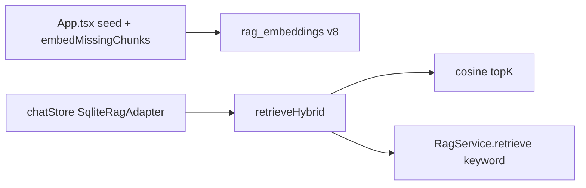
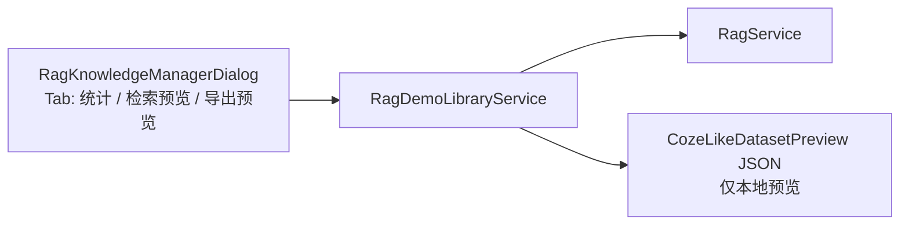
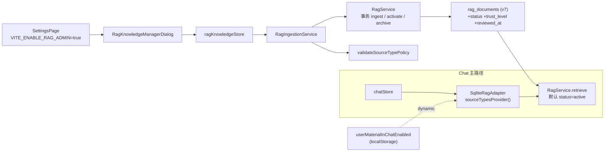

# Time Manager V3.7 — Current Logic Architecture

> 文档版本：1.0  
> 生成日期：2026-05-31  
> 适用状态：Product V2.5 Done + V3.7 Integration Freeze Done + Agent Track V5 Mock-First Done

---

## 1. 版本定位

这份文档描述的是 **V3.7 Integration Freeze 后的当前逻辑架构**。

它和 `docs/V1/architecture.md` 的最大区别是：

- V1 主要描述 `Chat -> IntentParser -> ToolRouter -> Tool -> Service`。
- V3.7 已经增加了 Domain Router、TimeManagementAgent、Planner、LLM fallback、安全验证、只读 Handler、Heartbeat 执行反馈、Memory/RAG mock-first 接口。

当前系统的核心思想是：

```text
用户可以用自然语言表达目标，
Agent 可以理解、规划和建议，
但所有写入都必须经过安全壳：

PlanSafetyValidator
  -> ConfirmationPolicy
  -> ToolRouter
  -> Tool
  -> Service
  -> Repository
  -> SQLite
```

换成甲乙方比喻：

```text
用户 = 甲方 / 委托方
Agent = 方案顾问 / 项目经理
Tool = 执行部门
Service = 公司制度 / 业务流程
Repository + DB = 档案室 / 账本
Confirmation = 盖章确认
ActionLog = 留痕审计
ResponseBoundary = 对外沟通口径
```

---

## 2. 总体逻辑架构

```text
┌────────────────────────────────────────────────────────────────────────────┐
│                            User / Student                                  │
│                                                                            │
│  手动操作 Todo / Timeline                      自然语言对话 Chat            │
└───────────────┬───────────────────────────────────────┬────────────────────┘
                │                                       │
                ▼                                       ▼
┌──────────────────────────────────┐     ┌───────────────────────────────────┐
│        React UI Layer             │     │          Chat UI Layer             │
│  TodayPage / Timeline / Todo      │     │  ChatPage / ChatPanel / Message    │
└───────────────┬──────────────────┘     └────────────────┬──────────────────┘
                │                                           │
                ▼                                           ▼
┌──────────────────────────────────┐     ┌───────────────────────────────────┐
│        Zustand Store Layer        │     │          chatStore                 │
│  taskStore / timeBlockStore       │     │  load / send / confirm / reject    │
│  heartbeatStore / uiStore         │     └────────────────┬──────────────────┘
└───────────────┬──────────────────┘                      │
                │                                          ▼
                │                         ┌───────────────────────────────────┐
                │                         │          AgentService              │
                │                         │  Agent 总入口 / 调度中心            │
                │                         └────────────────┬──────────────────┘
                │                                          │
                │                                          ▼
                │                         ┌───────────────────────────────────┐
                │                         │       DomainRoutingService         │
                │                         │  Contextual -> LLM -> Rule fallback│
                │                         └───────────────┬───────────────────┘
                │                                         │
                │              ┌──────────────────────────┴──────────────────────────┐
                │              │                                                     │
                ▼              ▼                                                     ▼
┌──────────────────────────────────┐                       ┌─────────────────────────┐
│          Core Services            │◄──────────────────────│   TimeManagementAgent    │
│  TaskService                      │        Tool calls      │  Parser / Planner / Safe │
│  TimeBlockService                 │                       └────────────┬────────────┘
│  ScheduleService                  │                                    │
│  HeartbeatService                 │                       ┌────────────▼────────────┐
│  ConversationService              │                       │      ToolRouter          │
│  ConfirmationService              │                       │  17 core tools           │
│  ActionLogService                 │                       └────────────┬────────────┘
└───────────────┬──────────────────┘                                    │
                │                                                       │
                ▼                                                       │
┌──────────────────────────────────┐                                    │
│       Repository Interface        │◄───────────────────────────────────┘
│  ITaskRepository                  │
│  ITimeBlockRepository             │
│  IConversationRepository          │
│  IConfirmationRepository          │
│  IActionLogRepository             │
└───────────────┬──────────────────┘
                │
                ▼
┌──────────────────────────────────┐
│       SQLite Repository Impl      │
│  SqliteTaskRepository             │
│  SqliteTimeBlockRepository        │
│  SqliteConversationRepository     │
│  SqliteConfirmationRepository     │
│  SqliteActionLogRepository        │
└───────────────┬──────────────────┘
                │
                ▼
┌──────────────────────────────────┐
│          Local SQLite DB          │
│  tasks / time_blocks              │
│  conversation_messages            │
│  pending_confirmations            │
│  agent_action_logs                │
│  schema_version                   │
└──────────────────────────────────┘
```

---

## 3. 两条入口路径

### 3.1 手动操作路径

用户手动创建 Todo、编辑 TimeBlock、拖动或点击 UI 时，通常不需要 Agent 参与。

```text
User
  -> React UI
  -> Zustand Store
  -> Service
  -> Repository
  -> SQLite
```

这条路径负责稳定的基础业务：

- Task CRUD
- TimeBlock CRUD
- 手动安排任务
- 时间冲突检测
- Timeline 展示
- Heartbeat 状态更新

### 3.2 Agent 对话路径

用户通过 Chat 说自然语言时，进入 Agent 系统。

```text
User
  -> Chat UI
  -> chatStore
  -> AgentService.processInput()
  -> DomainRoutingService
  -> TimeManagementAgent or Read-only Handler
  -> ResponseBoundary
  -> ChatMessage
```

只有 `time_management` domain 允许继续进入写操作链路。

---

## 4. Domain Router：先分流，再思考

V3.6 之后，Agent 不再把所有输入都塞进时间管理 Parser，而是先做 domain 分发。

```text
┌───────────────────────────┐
│       Raw User Input       │
└────────────┬──────────────┘
             ▼
┌───────────────────────────┐
│    ContextualPreRouter     │
│  高确定性上下文判断          │
│  pending confirm / reject  │
└────────────┬──────────────┘
             │ 未命中
             ▼
┌───────────────────────────┐
│     LLMDomainClassifier    │
│  只分类，不回答，不调工具     │
│  严格 JSON + schema 校验    │
└────────────┬──────────────┘
             │ 不可用 / 低置信 / 非法
             ▼
┌───────────────────────────┐
│  AgentDomainRouter fallback│
│  规则/关键词兜底             │
└────────────┬──────────────┘
             ▼
┌───────────────────────────┐
│        Domain Result       │
└───────────────────────────┘
```

当前 8 个 domain：

| Domain | 用途 | 能否写 Task / TimeBlock |
|---|---|---|
| `time_management` | 创建、安排、查询、删除、延期、重排 | 可以，但必须走 ToolRouter |
| `assistant_meta` | 问助手身份、模型、能力、应用帮助 | 不可以 |
| `general_chat` | 普通聊天 | 不可以 |
| `knowledge_qa` | 知识问答 | 不可以 |
| `writing_assistant` | 写作辅助、润色、生成文本 | 不可以 |
| `external_info` | 天气、新闻、外部实时信息入口 | 不可以 |
| `feedback_or_complaint` | 用户反馈、抱怨、纠错 | 不可以 |
| `low_signal` | 空输入、问号、低信息量输入 | 不可以 |

关键原则：

```text
只有 time_management 可以接触 ToolRouter 写数据。
其他 7 个 domain 都是 read-only handler。
```

---

## 5. TimeManagementAgent：时间管理主链路

当 domain 是 `time_management` 时，进入时间管理子 Agent。

```text
┌─────────────────────────────┐
│      TimeManagementAgent     │
└──────────────┬──────────────┘
               ▼
┌─────────────────────────────┐
│      SemanticFrameParser     │
│  抽取目标、时间、时长、对象引用 │
└──────────────┬──────────────┘
               ▼
┌─────────────────────────────┐
│       CompositePlanner       │
│  LLMExperiencePlanner first  │
│  ActionPlanner fallback      │
└──────────────┬──────────────┘
               ▼
┌─────────────────────────────┐
│     ExperienceActionPlan     │
│  结构化计划，不是直接执行      │
└──────────────┬──────────────┘
               ▼
┌─────────────────────────────┐
│     PlanSafetyValidator      │
│  toolName / args / actions   │
│  policy upgrade / whitelist  │
└──────────────┬──────────────┘
               ▼
┌─────────────────────────────┐
│     ConfirmationPolicy       │
│  safe / confirm / destructive│
└──────────────┬──────────────┘
               ▼
┌─────────────────────────────┐
│  ToolRouter or Confirmation  │
└─────────────────────────────┘
```

Planner 只负责决定“想做什么”，不负责绕过安全执行。

常见计划类型：

| 计划 | 含义 |
|---|---|
| `tool` | 直接调用单个工具 |
| `request_recommendation` | 生成排程候选，等待用户确认 |
| `confirmation_required` | 危险操作，先创建确认 |
| `batch_action` | 批量操作，拆成 `actions[]` 后执行 |
| `defer_task` | 延期任务，拆成可执行子操作 |
| `direct_response` | 只回复，不写数据 |
| `clarification` | 信息不足，需要追问 |

---

## 6. V3.7 安全壳：Agent 不能裸写数据

V3.7 的重点是把“聪明的大脑”关进“可靠的执行壳”。

```text
LLM / Rule Planner
  │
  │ 只能输出结构化 ExperienceActionPlan
  ▼
Zod Schema Validation
  │
  ▼
PlanSafetyValidator
  │
  ├─ toolName 必须存在于 ToolRouter
  ├─ actions[] 必须结构合法
  ├─ batch/defer 必须拆成可执行动作
  ├─ 危险操作强制升级 confirmation
  └─ 不合法计划直接拒绝
  ▼
ConfirmationPolicy
  │
  ├─ safe: 可直接执行
  ├─ confirm: 需要用户确认
  └─ destructive: 必须确认
  ▼
ToolRouter
  │
  ▼
Tool
  │
  ▼
Service
  │
  ▼
Repository
  │
  ▼
SQLite
```

这层的核心目的：

- LLM 不能直接写数据库。
- LLM 不能自己决定危险操作无需确认。
- LLM 不能调用不存在的工具。
- 批量和延期操作不能只“看起来确认”，必须确认后真实执行。
- 每一步都能写日志和追踪。

---

## 7. ToolRouter 与 Tool 层

ToolRouter 是 Agent 的唯一执行入口。

```text
ToolRouter
  ├─ Task Tools
  │   ├─ create_task
  │   ├─ update_task
  │   ├─ delete_task
  │   ├─ list_tasks
  │   └─ mark_task_completed
  │
  ├─ TimeBlock Tools
  │   ├─ create_time_block
  │   ├─ update_time_block
  │   ├─ delete_time_block
  │   ├─ list_time_blocks
  │   └─ bind_task_to_time_block
  │
  ├─ Schedule Tools
  │   ├─ schedule_task
  │   ├─ reschedule_day
  │   ├─ detect_conflicts
  │   ├─ get_free_slots
  │   └─ get_today_plan
  │
  └─ Explain Tools
      ├─ explain_task
      └─ explain_schedule
```

Tool 的职责：

```text
接收结构化参数
  -> 调用对应 Service
  -> 返回 AgentToolResult
```

Tool 不应该：

- 直接写 SQL。
- 绕过 Service。
- 自己承担复杂业务规则。

---

## 8. Service Layer：业务规则中心

Service 是系统真正的业务规则层。

```text
TaskService
  -> Task 创建、更新、删除、状态流转

TimeBlockService
  -> TimeBlock 创建、更新、删除、执行状态更新

ScheduleService
  -> Task 与 TimeBlock 的跨实体操作
  -> 安排任务、移回 Todo、冲突检测

HeartbeatService
  -> 到点提醒、开始、结束反馈
  -> done / skipped / delayed 联动

ConversationService
  -> Chat 消息持久化
  -> metadata 更新

ConfirmationService
  -> pending confirmation 创建、确认、拒绝、过期

ActionLogService
  -> 请求、工具执行、成功、失败、取消记录
```

手动 UI 和 Agent Tool 最终都要落到 Service，因此规则一致。

---

## 9. Confirmation 与 batch/defer 闭环

V3.7 前的风险是：batch / defer 能创建 confirmation，但确认后不一定能执行真实子动作。

V3.7 后的路径：

```text
用户：删除这些任务
  -> TimeManagementAgent
  -> ActionPlanner / LLMExperiencePlanner
  -> ExperienceActionPlan(kind=batch_action)
  -> params.actions[] = [
       { toolName: "delete_task", params: {...} },
       { toolName: "delete_task", params: {...} }
     ]
  -> PlanSafetyValidator
  -> ConfirmationService.create()
  -> 用户确认
  -> AgentService.confirmAction()
  -> executeActionList(actions[])
  -> ToolRouter 顺序执行每个子动作
  -> 任一步失败则 short-circuit
  -> 每步写 ActionLog
```

这保证“确认”不是装饰，而是真正进入执行闭环。

---

## 10. ResponseBoundary：用户可见出口

ResponseBoundary 是所有用户可见文本的出口守门。

```text
Handler / Agent result
  -> ResponseBoundary.finalize()
  -> ResponseComposer
  -> ChatMessage
```

它负责：

- 清除内部名：`ToolRouter`、`ActionPlanner`、`toolName` 等。
- 避免把 JSON 原样显示给用户。
- 统一成功、失败、确认、拒绝、追问、低信号等文案。
- 避免 LLM 或异常路径把内部实现细节泄漏出来。

可以理解为：

```text
ResponseBoundary = 对外沟通口径 / 文书润色 / 出口安检
```

---

## 11. Heartbeat：持续执行感知器

Heartbeat 不是 Agent 大脑，而是执行反馈引擎。

```text
TodayPage
  -> heartbeatStore
  -> HeartbeatService.evaluateNow()
  -> TimeBlockService / TaskService
  -> UI prompts / feedback dialogs
```

核心状态流：

```text
scheduled
  -> start prompt
  -> in_progress
  -> end feedback
  -> done / skipped / delayed
  -> Task 状态联动
```

V3.7 后的补强：

```text
feedback_snoozed_until
```

当用户对结束反馈选择“暂不处理”时，系统会把 snooze 时间持久化，避免短时间内反复弹窗。

Heartbeat 的定位：

```text
持续看表、提醒、催办、反馈；
不负责长期规划，不替代 Agent。
```

---

## 12. Memory / RAG / Notification：未来扩展层

当前这一层是 mock-first，不是生产化能力。

```text
┌──────────────────────┐
│    MemoryAdapter      │
│ 用户行为偏好 / 历史规律 │
└──────────┬───────────┘
           │
           ▼
┌──────────────────────┐
│      RagAdapter       │
│ 外部知识 / 历史摘要 / 通知│
└──────────┬───────────┘
           │
           ▼
┌──────────────────────┐
│ RecommendationHandler │
│ 综合建议，不直接写库    │
└──────────────────────┘
```

### MemoryAdapter

Memory 更像“乙方对甲方偏好的长期了解”：

- 用户常在哪些时间段完成任务。
- 哪类任务经常拖延。
- 估时是否偏短。
- 哪些任务适合拆分。
- 最近执行习惯如何。

### RagAdapter

RAG 更像“乙方查阅的资料库”：

- 时间管理理论。
- 艾宾浩斯、番茄工作法、复习策略。
- 课程通知。
- 班级群转发摘要。
- 讲座、比赛、报名材料。

### NotificationAdapter

NotificationAdapter 是未来通知出口：

- 桌面通知。
- 浏览器通知。
- 邮件。
- 手机推送。
- 企业微信 / 飞书 / webhook。

当前这些接口主要用于测试和未来生产化，不应被理解为已经完整落地。

### V3.8 RAG 实表落地状态（含收口修正）

> 更新日期：2026-06-01（V3.8 收口修正）

V3.8 RAG Foundation 已落地并完成收口修正，但**仅是 Product V5 Production Memory 的第 1 步**，不构成 V5 封板。详见 [`docs/V3.8/V3.8_IMPLEMENTATION_PLAN.md`](../V3.8/V3.8_IMPLEMENTATION_PLAN.md)。

```text
rag_documents + rag_chunks（SQLite v6 migration，含事务保护）
   │
   ▼
RagService（ingestDocument[事务] / retrieve / list / delete）
   │  构造函数支持 RagDb 注入，测试无需 Tauri window
   ▼
SqliteRagAdapter（实现现有 RagAdapter 接口，defaultSourceTypes: ["seed_knowledge"]）
   │  注入 chatStore.ts 的 AgentService（仅 Chat 主路径）
   ▼
RecommendationHandler（语义化 ragQuery：userInput + blockTitles，不再用 currentDatetime）
   │
   ▼
sanitizeRecommendation（去除内部名/JSON指令/命令口吻）
   │
   ▼
AgentService.processInput → 以"---\n💡"注脚追加到 time_management 回复末尾
```

| 维度 | 状态 |
|---|---|
| SQLite 实表 | ✅ rag_documents / rag_chunks（migration v6） |
| 内置 seed_knowledge | ✅ 5 条时间管理理论，App 启动幂等写入 |
| 检索算法 | ✅ Chat 主路径：**hybrid**（vector cosine topK → keyword fallback）；管理预览仍为 keyword |
| 生产 Adapter | ✅ `SqliteRagAdapter`（实现现有 `RagAdapter` 接口） |
| Chat 主路径接入 | ✅ chatStore.ts 注入 `SqliteRagAdapter`，`sourceTypes: ["seed_knowledge"]` |
| RAG query 语义化 | ✅ 使用 userInput + blockTitles，不再使用 currentDatetime |
| RAG 输出安全清洗 | ✅ `sanitizeRecommendation` 去除内部名/JSON指令/命令口吻 |
| ingestDocument 事务 | ✅ BEGIN/COMMIT/ROLLBACK，chunk 写入失败自动 ROLLBACK |
| tags 语义澄清 | ✅ `RagQueryOptions.tags` 明确为 score boost，不是访问控制 |
| **资料状态治理** | **✅ V3.8.1：migration v7 引入 status / trust_level / reviewed_at** |
| **UI 知识库管理器** | **✅ V3.8.1：`VITE_ENABLE_RAG_ADMIN=true` 时 SettingsPage → 全屏 Dialog；左列表 + 右详情/表单** |
| **资料治理服务** | **✅ V3.8.1：`RagIngestionService`（Policy + 生命周期），不直接读写 DB** |
| **双门控（user_material）** | **✅ V3.8.1：全局 toggle AND 文档 active 双满足才进入 Chat 检索** |
| **retrieve 默认 active-only** | **✅ V3.8.1：`RagService.retrieve` 默认硬过滤 `status='active'`** |
| external_context 写入端 | ❌ 自动导入仍未实现；UI 可手动录入但被 Policy 强制 draft |
| **vector retrieve / hybrid** | **✅ V3.8.3：`VectorRagService.retrieveVector` + `retrieveHybrid`；`SqliteRagAdapter` 注入** |
| **EmbeddingProvider** | **✅ V3.8.3：`DeterministicEmbeddingProvider`（dim=64）；OpenAI 草案默认不启用** |
| **rag_embeddings** | **✅ V3.8.3：migration v8；`vector_json` + 内存 cosine** |
| **VectorStore 接口** | **✅ V3.8.4 接口；V3.8.5 `SqliteVectorStore` 可运行** |
| **HybridRetriever** | **✅ V3.8.5 `SelfHostedHybridRetriever`（RRF）；V3.8.4 `LegacyHybridRetriever` 仍可用** |
| **Keyword FTS5** | **✅ V3.8.5：`SqliteFtsKeywordSearch` + migration v9** |
| **Reranker** | **✅ `NoopReranker` hook；生产 reranker 未接** |
| **RAG Evaluation** | **✅ V3.8.5：`RagEvaluationService`（测试 harness）** |
| **Chat self_hosted flag** | **✅ `VITE_RAG_ENGINE=self_hosted`（默认 off）** |
| **RagEngine（统一入口）** | **✅ V3.8.6：`RagEngine` + `RagEngineFactory`** |
| **RagIndexManager** | **✅ V3.8.6：keyword/vector rebuild + document refresh + job 环** |
| **RagRetrievalPipeline** | **✅ V3.8.6：QueryStrategy → retrieve → rerank → diagnostics** |
| **RagAdminActions** | **✅ V3.8.6 服务层；V3.8.7 Admin UI Tab** |
| **Production Embedding** | **✅ V3.8.7：env 可配置 + 缺 key fallback deterministic** |
| **VectorStoreFactory** | **✅ V3.8.7：sqlite_json / disabled + 维护 API** |
| **ScoreReranker** | **✅ V3.8.7：规则加权；`VITE_RAG_RERANKER=score`** |
| **Evaluation Dataset** | **✅ V3.8.7：defaultRagEvalCases + 多指标** |
| **MemoryToRagBridge** | **✅ V3.8.7：预留；未接入 App** |
| 大型向量库 / 生产 Reranker | ❌ 留给 V3.9 封板 |
| Memory 生产化 | ❌ 仍为 `MockMemoryAdapter`，Product V5 后续步骤 |
| Heartbeat AgentService | ❌ 未注入 RAG（刻意保留，避免污染） |
| system_guidance UI 写入 | ❌ Policy 拒绝；只能由系统内部路径写入 |
| **Demo Library 统计** | **✅ V3.8.2：`RagDemoLibraryService.getStats` + Dialog Tab「统计」** |
| **检索预览** | **✅ V3.8.2：`previewRetrieve` + Tab「检索预览」（仅 active，可选 sourceTypes）** |
| **Coze-like 导出预览** | **✅ V3.8.2：JSON 预览不调 Coze API；默认排除 external_context / system_guidance / memory_summary** |
| **正式部署 RAG 策略** | **V3.8.4 Self-hosted RAG Engine（自建完整引擎）；Coze 路线已废弃为正式核心；V3.8.2 仅历史演示层** |

安全边界（在 RAG 实表落地与 V3.8.1 治理后依然成立）：

- RAG 不调用 ToolRouter，不写 tasks / time_blocks。
- `external_context.actionItems` 永远是 candidate，必须走 Import Proposal → 用户确认 → ToolRouter。
- 建议注脚不创建 confirmation、不写 ActionLog、不触发 refresh；失败静默降级。
- `external_context / user_material` 默认不进入用户可见建议（由 `sourceTypes: ["seed_knowledge"]` 约束）。
- V3.8.1：新文档默认 `status='draft'`，未激活不会被 retrieve；external_context 经 UI 写入被 Policy 强制 draft；system_guidance UI 写入/激活直接拒绝。
- V3.8.1：memory_summary 仅预留给未来 Memory 系统，UI 写入/激活直接拒绝。
- V3.8.1：user_material 进入 Chat 检索需"全局 toggle ON + 文档 active"双门控。
- 测试覆盖：45 files / **358 tests** all green（含 V3.8.7 Production Pack）。

### V3.8.7 RAG Production Pack 概览

- 可配置 Embedding Provider（默认 deterministic，不联网）
- VectorStoreFactory + DisabledVectorStore + Sqlite 维护接口
- Reindex：`durationMs` / `warnings` / `clearVectorIndex` / `reindexForEmbeddingModelChange`
- ScoreReranker + Evaluation 固定 dataset + Admin Panel（`VITE_ENABLE_RAG_ADMIN`）
- MemoryToRagBridge 预留（system-only ingest）

详见 [`docs/V3.8/V3.8.7_RAG_PRODUCTION_PACK_PLAN.md`](../V3.8/V3.8.7_RAG_PRODUCTION_PACK_PLAN.md)。

### V3.8.6 RAG Engine Scaffold 概览

- `RagEngine`：retrieve / ingest / activate / rebuild / health / evaluate
- `RagRetrievalPipeline` + `DefaultRagQueryStrategy`（无 LLM）
- `RagIndexManager`：同步 job + 内存 ring buffer
- `SqliteRagAdapter`：`ragEngine` > hybrid > vector > keyword
- `RagAdminActions`：rebuild / evaluation / health（Settings UI 后续）

详见 [`docs/V3.8/V3.8.6_RAG_ENGINE_SCAFFOLD_PLAN.md`](../V3.8/V3.8.6_RAG_ENGINE_SCAFFOLD_PLAN.md)。

### V3.8.5 Self-hosted RAG Engine MVP 概览

- FTS5 `rag_chunks_fts` + `SqliteFtsKeywordSearch`
- `SqliteVectorStore`（`rag_embeddings` + cosine）
- `SelfHostedHybridRetriever`：并行召回 + RRF + `NoopReranker`
- `VITE_RAG_ENGINE=self_hosted` 启用 Chat 新栈；默认仍 V3.8.3

详见 [`docs/V3.8/V3.8.5_SELF_HOSTED_RAG_ENGINE_MVP_PLAN.md`](../V3.8/V3.8.5_SELF_HOSTED_RAG_ENGINE_MVP_PLAN.md)。

### V3.8.4 Self-hosted RAG Engine 路线概览

- 路线从「Coze 优先」切换为 **自建完整 RAG Engine**
- 接口骨架：`VectorStore`、`HybridRetriever`（`LegacyHybridRetriever`）、`Reranker`（`NoopReranker`）
- Chat 主路径仍用 V3.8.3 `VectorRagService`（dev fallback），**未改** `SqliteRagAdapter` 接线

详见 [`docs/V3.8/V3.8.4_SELF_HOSTED_RAG_ENGINE_PLAN.md`](../V3.8/V3.8.4_SELF_HOSTED_RAG_ENGINE_PLAN.md)。

### V3.8.3 Minimal Local Vector RAG 概览



详见 [`docs/V3.8/V3.8.3_MINIMAL_LOCAL_VECTOR_RAG_PLAN.md`](../V3.8/V3.8.3_MINIMAL_LOCAL_VECTOR_RAG_PLAN.md)。

> **路线已调整（V3.8.4）**：正式 RAG 不再优先 Coze，见 [V3.8.4_SELF_HOSTED_RAG_ENGINE_PLAN.md](../V3.8/V3.8.4_SELF_HOSTED_RAG_ENGINE_PLAN.md)。以下 V3.8.2 为历史演示层说明。

### V3.8.2 Local Coze-like Demo Library 概览



详见 [`docs/V3.8/V3.8.2_LOCAL_COZE_LIKE_RAG_DEMO_PLAN.md`](../V3.8/V3.8.2_LOCAL_COZE_LIKE_RAG_DEMO_PLAN.md)。

### V3.8.1 Knowledge Manager 概览



详见 [`docs/V3.8/V3.8.1_RAG_KNOWLEDGE_MANAGER_PLAN.md`](../V3.8/V3.8.1_RAG_KNOWLEDGE_MANAGER_PLAN.md)。

---

## 13. Future Inbox / External Context 位置

未来如果接入班级消息、网页、公众号文章、课程表、截图 OCR，建议新增 Inbox / ExternalContext 层。

正确路径：

```text
外部信息
  -> InboxItem / ExternalContext
  -> 结构化解析
  -> Agent Brief
  -> Import Proposal
  -> 用户确认
  -> ToolRouter
  -> Service
  -> Task / TimeBlock
```

错误路径：

```text
外部信息
  -> 直接写 Task / TimeBlock
```

Future Inbox 应该遵守当前架构原则：

- 外部内容先进入候选池。
- 解析结果必须可预览。
- 用户确认后才写入任务或时间块。
- 所有导入写操作应进入 ActionLog。

---

## 14. 当前架构职责速查

| 部分 | 类比 | 职责 |
|---|---|---|
| UI | 用户窗口 | 展示和交互 |
| Store | 前台接待 / 状态缓存 | 接 UI 动作，调用 Service 或 AgentService |
| AgentService | 总调度 | 接收自然语言，组织上下文，分发处理 |
| DomainRoutingService | 前台分诊 | 判断输入属于哪个 domain |
| TimeManagementAgent | 时间管理项目经理 | 解析目标，生成计划，推进执行链路 |
| Planner | 方案生成 | LLM 或规则生成结构化计划 |
| PlanSafetyValidator | 风控审核 | 检查计划合法性和安全等级 |
| ConfirmationService | 盖章确认 | 危险操作等待用户确认 |
| ToolRouter | 派单系统 | 选择并调用工具 |
| Tool | 执行部门 | 调用 Service 完成具体动作 |
| Service | 制度和业务流程 | 校验、状态机、跨实体规则 |
| Repository | 档案接口 | 读写持久化数据 |
| SQLite | 账本 | 本地数据存储 |
| ActionLog | 审计留痕 | 记录请求、执行、结果 |
| AgentTrace | 调试轨迹 | 记录 Agent 解析、规划、路由过程 |
| ResponseBoundary | 对外口径 | 清理内部细节，统一回复 |
| Heartbeat | 进度跟踪 | 到点提醒、执行反馈、状态联动 |
| MemoryAdapter | 长期偏好 | 用户行为记忆 |
| RagAdapter | 资料库 | 外部知识和通知检索 |
| NotificationAdapter | 通知出口 | 未来系统通知 / webhook / 推送 |

---

## 15. 一句话版

```text
UI 是入口，
Store 管状态，
Service 管业务，
Repository 管数据，
Agent 只做理解和提案，
ToolRouter 是唯一执行手，
Confirmation 是刹车，
ActionLog 是黑匣子，
ResponseBoundary 是出口安检，
Heartbeat 管执行反馈，
Memory/RAG 管长期上下文。
```

最新架构的灵魂是：

> Agent 可以越来越聪明，但它永远不能越权。
