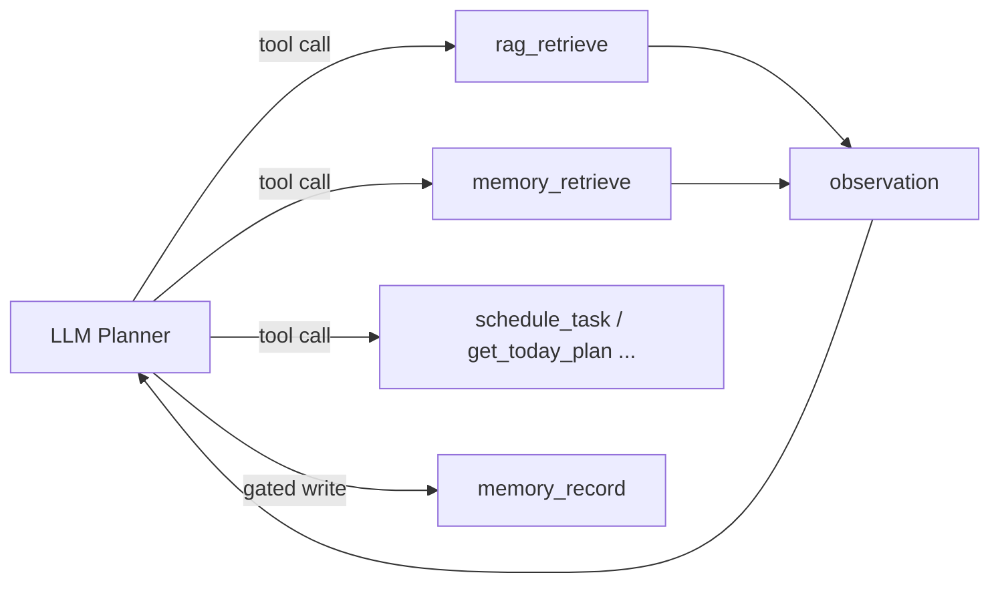

# RAG & Memory 工具化架构说明（V3.8+）

> 本文档记录 RAG / Memory 从"隐式上下文拼接"向"Agent 可主动调用的工具/能力"演进的架构决策。
> 本阶段只做接口预留与边界说明，不切换现有主链路。

---

## 1. 当前状态

| 能力 | 当前实现 | 位置 |
|---|---|---|
| RAG-before-LLM | 过渡式隐式 prompt 注入 | [`src/agent/llm/ragContext.ts`](../../src/agent/llm/ragContext.ts) → `LLMExperiencePlanner.plan()` |
| RAG 后置注脚 | `maybeAppendRecommendation()` 附加建议 | [`src/agent/AgentService.ts`](../../src/agent/AgentService.ts) |
| RAG 工具骨架 | `rag_retrieve` Tool 类已存在，**未注册** | [`src/agent/tools/rag/ragRetrieveTool.ts`](../../src/agent/tools/rag/ragRetrieveTool.ts) |
| Memory 隐式链路 | `memoryAdapter` 服务于 `RecommendationHandler` | [`src/agent/memory/MemoryAdapter.ts`](../../src/agent/memory/MemoryAdapter.ts) |
| Memory 工具骨架 | `memory_retrieve` / `memory_record` Tool 类已存在，**未注册** | [`src/agent/tools/memory/`](../../src/agent/tools/memory/) |

---

## 2. 本阶段结论

- **RAG 当前阶段收口**：不继续扩大 `ragContext.ts` 的隐式 prompt 注入职责；不继续把 RAG 作为最终回复后置装饰来扩展。
- **Memory 当前阶段收口**：只做接口与工具雏形，不接真实数据库，不改变现有 `MemoryAdapter` / `MockMemoryAdapter` 行为。
- **下一阶段重点**：tool loop / observation / replan，让 LLM 能在多步循环中主动调用知识/记忆工具后继续规划任务/日程工具。

---

## 3. 目标状态

- **RAG** 作为 `rag_retrieve` 工具：Agent 在规划过程中按需检索知识库，拿到 snippets 后继续调用时间管理工具。
- **Memory** 作为 `memory_retrieve`（只读）/ `memory_record`（写入，需策略层）能力：Agent 读取用户长期偏好与行为模式，并在明确策略下沉淀新记忆。

---

## 4. 为什么现在不直接注册这些工具

1. **缺少多步 tool loop**：当前 `LLMExperiencePlanner` 是单轮 JSON plan，不具备 `tool → observation → replan` 循环。如果暴露 `rag_retrieve` / `memory_retrieve`，LLM 可能只检索知识/记忆就结束，无法继续调用 `schedule_task` / `get_today_plan` 等工具完成任务规划。
2. **prompts.ts 工具白名单未扩展**：`TOOL_DESCRIPTIONS` 中不包含 `rag_retrieve` / `memory_retrieve` / `memory_record`，避免 LLM 当前阶段就开始主动调用。
3. **memory_record 写入风险**：涉及长期状态写入，需要先去重、置信度、用户可见性、可选 confirmation 等策略落地，不能让 LLM 随意写长期记忆。
4. **RAG-before-LLM 过渡链路仍可用**：在 tool loop 落地前，`ragContext.ts` 的隐式注入仍能为 LLM planner 提供专业上下文，用于验证 RAG 对规划质量的提升。

---

## 5. 后续步骤

1. 注册 `rag_retrieve` / `memory_retrieve` 到 `ToolRouter`（`memory_record` 需策略层先行）。
2. 将知识/记忆工具加入 `prompts.ts` 的 `TOOL_DESCRIPTIONS` 工具白名单。
3. `LLMExperiencePlanner` 支持 tool observation / replan 多步循环。
4. `AgentTrace` 中记录 RAG / Memory tool call 元数据。
5. 设计 `MemoryWritePolicy`（去重 / 置信度 / 可见性 / confirmation），再开放 `memory_record`。
6. 逐步减少 `ragContext.ts` 的隐式 prompt 注入，降级为 fallback 或 debug/probe 入口。

---

## 6. 核心设计原则

> **RAG should be modeled as an agent tool, not as a prompt preprocessor or response postprocessor.**

> **Memory should be modeled as an agent capability with explicit read/write boundaries, not as scattered implicit state.**

中文表述：

- RAG 应该被建模为 Agent 可主动调用的知识检索工具，而不是固定的 prompt 前置拼接或回复后置装饰。
- Memory 应该被建模为具有明确读写边界的 Agent 能力，而不是散落在业务代码里的隐式状态。

---

## 7. 相关文件索引

| 文件 | 职责 |
|---|---|
| [`src/agent/tools/rag/ragRetrieveTool.ts`](../../src/agent/tools/rag/ragRetrieveTool.ts) | RAG 工具化入口（未注册） |
| [`src/agent/tools/memory/memoryRetrieveTool.ts`](../../src/agent/tools/memory/memoryRetrieveTool.ts) | Memory 只读工具骨架（未注册） |
| [`src/agent/tools/memory/memoryRecordTool.ts`](../../src/agent/tools/memory/memoryRecordTool.ts) | Memory 写入工具骨架（未注册，永远 `recorded=false`） |
| [`src/agent/llm/ragContext.ts`](../../src/agent/llm/ragContext.ts) | RAG-before-LLM 过渡层 |
| [`src/agent/memory/MemoryAdapter.ts`](../../src/agent/memory/MemoryAdapter.ts) | Memory 适配器接口 |
| [`src/agent/memory/RagAdapter.ts`](../../src/agent/memory/RagAdapter.ts) | RAG 适配器接口 |
| [`src/agent/AgentService.ts`](../../src/agent/AgentService.ts) | `registerTools()` 注释说明未注册原因 |
