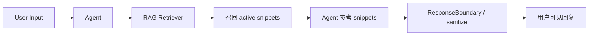
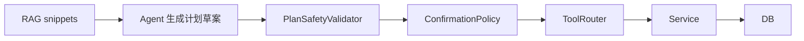
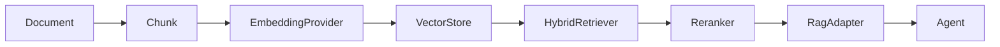

# V3.8.1 RAG Knowledge Manager + Vector Prep

> 文档版本：1.0
> 状态：已落地（2026-06-01）
> 定位：V3.8 RAG Foundation 的延续；**仍不是真正向量库**。
> 版本约束：本轮命名为 **V3.8.1**，不命名 V3.9（V3.9 留给真正向量 RAG 闭环完成之后）。

---

## 1. 本轮目标

让普通用户和开源使用者可以通过 UI 手动录入、查看、启用、归档语料，
不再要求开发者手改 SQLite 或运行私有脚本。同时把 RAG 的构造原则、SourceType 语义、
Knowledge / Memory 分区、向量化未来路径在文档里讲清楚。

**不做的事情**：

- 不引入真实 embedding / 向量库 / sqlite-vec / pgvector / LangChain / LlamaIndex。
- 不让 RAG 结果直接生成 ToolRouter action。
- 不让 external_context 默认进入用户可见建议。
- 不修改核心 task/timeblock 业务规则。
- 不命名为 V3.9。

---

## 2. RAG 构造原则

### 2.1 RAG 不是业务数据库

| 业务数据库（系统事实） | RAG（参考依据） |
|---|---|
| tasks | 时间管理理论 |
| time_blocks | 学习方法 |
| schedules | 课程材料 |
| confirmations | 班级通知摘要 |
| action_logs | 用户上传资料 |
|  | 未来的 memory_summary |

业务数据库决定"系统真实状态"；RAG 只提供"参考依据"。**RAG 不能直接驱动写操作。**

### 2.2 资料标准入境流程

```text
Raw Material
  -> Normalize 清洗
  -> Metadata 标注
  -> Chunk 切片
  -> Draft Document
  -> Review / Activate
  -> Retrieve 可见
  -> 后续生成 embedding / vector index
```

每一步职责：

| 步骤 | 职责 |
|---|---|
| Raw Material | 原始文本、手动录入、网页摘录、课程通知等。 |
| Normalize | 去掉无意义格式，保留正文和来源。 |
| Metadata | 写入 sourceType、tags、sourceRef、trustLevel、status。 |
| Chunk | 把长文切成适合检索的小段。 |
| Draft | 默认不可被 Agent 检索。 |
| Review/Activate | 人工确认后 active。 |
| Retrieve | 只有 active 且符合 sourceType 过滤的资料可被召回。 |
| Vector Index | 后续阶段再加入 embedding。 |

### 2.3 SourceType 语义

| sourceType | 解释 | V3.8.1 UI 写入 | 默认 status |
|---|---|---|---|
| seed_knowledge | 人工维护的基础知识（番茄/艾宾浩斯/GTD 等）；高可信，不应由 Agent 自动写入。 | 允许（带红色谨慎提示） | active（系统种子）/ draft（手动新增） |
| user_material | 用户手动录入或上传的学习/课程材料；本轮单用户处理。 | 允许 | draft |
| external_context | 外部导入资料（群聊/网页/公众号摘要）；不允许直接生成任务或 timeblock。 | 允许，但**强制 draft** | draft（Policy 强制） |
| memory_summary | 未来由 Memory 系统生成的用户习惯总结；当前仅预留。 | 不开放 UI 写入，仅 system actor | draft |
| system_guidance | 系统行为指导；风险最高，UI 不开放写入。 | 拒绝 | — |

### 2.4 Knowledge Base 与 Memory Base 分区

RAG 在概念上分两区：

**A. Knowledge Base**
- 人工录入、手动整理、外部导入的资料。
- V3.8.1 主要实现这个区。
- Agent 的资料室，只读参考。

**B. Memory Base**
- 用户行为长期总结。
- 来自未来 MemoryAdapter / ProductionMemoryAdapter。
- V3.8.1 仅预留概念，不实现自动写入。

**分区原因**：

- Knowledge 是资料，Memory 是用户习惯/画像。
- 二者来源、权限、过期策略、可信度不同。
- 避免外部资料污染用户记忆。
- 避免用户隐私被当成通用知识。

### 2.5 RAG 与 Agent 的关系



涉及写操作时：



**禁止**：

- RAG → ToolRouter（任何直连）
- RAG 写 tasks / time_blocks
- RAG 绕过 confirmation
- 把 external_context.actionItems 当成已确认任务

### 2.6 当前 V3.8.1 RAG 形态

✅ 实现：

- UI 语料录入入口（`VITE_ENABLE_RAG_ADMIN=true` 时 SettingsPage → Dialog）
- `status: draft / active / archived` 状态
- `trust_level: low / medium / high`
- sourceType Policy
- active-only retrieve
- seed_knowledge 默认仍是 Chat 主路径唯一来源
- user_material 双门控开关：全局 toggle + 文档 active
- external_context 默认 draft
- system_guidance UI 拒绝

❌ 仍不实现：

- 真 embedding API
- 真向量库（sqlite-vec / pgvector）
- LangChain / LlamaIndex / Coze 插件
- 自动 Memory → RAG 写入
- owner_id / workspace_id / visibility 等多用户字段

---

## 3. 实现交付

### 3.1 新增文件

| 文件 | 作用 |
|---|---|
| [src/services/rag/RagIngestionService.ts](../../src/services/rag/RagIngestionService.ts) | Policy + 资料生命周期编排；不直接读写 DB |
| [src/store/ragKnowledgeStore.ts](../../src/store/ragKnowledgeStore.ts) | zustand store；维护 documents / userMaterialInChatEnabled |
| [src/components/rag/RagKnowledgeManagerDialog.tsx](../../src/components/rag/RagKnowledgeManagerDialog.tsx) | 全屏 Dialog 入口 |
| [src/components/rag/RagDocumentList.tsx](../../src/components/rag/RagDocumentList.tsx) | 左栏列表 + 过滤搜索 |
| [src/components/rag/RagDocumentForm.tsx](../../src/components/rag/RagDocumentForm.tsx) | 右栏新建表单（隐藏 system_guidance / memory_summary，锁定 external_context draft） |
| [src/components/rag/RagStatusBadge.tsx](../../src/components/rag/RagStatusBadge.tsx) | 状态/可信度/来源徽章 |
| [src/services/rag/__tests__/ragIngestion.test.ts](../../src/services/rag/__tests__/ragIngestion.test.ts) | 19 条 V3.8.1 测试 |
| [docs/V3.8/V3.8.1_RAG_KNOWLEDGE_MANAGER_PLAN.md](./V3.8.1_RAG_KNOWLEDGE_MANAGER_PLAN.md) | 本文 |

### 3.2 修改文件

| 文件 | 改动 |
|---|---|
| [src/db/migrations.ts](../../src/db/migrations.ts) | 新增 v7：`status` / `trust_level` / `reviewed_at`；幂等回填 seed_knowledge 为 active+high |
| [src/types/rag.types.ts](../../src/types/rag.types.ts) | `RagStatus` / `RagTrustLevel` / 字段扩展；`RagQueryOptions.includeNonActive` |
| [src/services/rag/RagService.ts](../../src/services/rag/RagService.ts) | `ingestDocument` 写入新字段；`retrieve` 默认 `status='active'` 硬过滤；新增 `activateDocument / archiveDocument / updateDocument`；`listDocuments` 支持 status/search |
| [src/services/rag/seedRagKnowledge.ts](../../src/services/rag/seedRagKnowledge.ts) | seed 显式 `status: 'active', trustLevel: 'high'` |
| [src/agent/memory/SqliteRagAdapter.ts](../../src/agent/memory/SqliteRagAdapter.ts) | 新增 `sourceTypesProvider` 选项，支持运行时切换 |
| [src/store/chatStore.ts](../../src/store/chatStore.ts) | 注入 `sourceTypesProvider` 读取 `userMaterialInChatEnabled` |
| [src/pages/SettingsPage.tsx](../../src/pages/SettingsPage.tsx) | 新增"知识库 / RAG 资料"section：toggle + feature-flagged 管理按钮 + Dialog 挂载 |

### 3.3 完全不动的文件

- `src/agent/memory/RagAdapter.ts`（RagSnippet 形状向后兼容）
- `src/agent/memory/MockRagAdapter.ts`
- `src/agent/time-management/RecommendationHandler.ts`
- `src/agent/AgentService.ts`
- 任何 `tasks` / `time_blocks` / `ToolRouter` 路径

---

## 4. 数据层：migration v7

```sql
ALTER TABLE rag_documents ADD COLUMN status TEXT NOT NULL DEFAULT 'draft';
ALTER TABLE rag_documents ADD COLUMN trust_level TEXT NOT NULL DEFAULT 'medium';
ALTER TABLE rag_documents ADD COLUMN reviewed_at TEXT;
CREATE INDEX IF NOT EXISTS idx_rag_documents_status ON rag_documents(status);

UPDATE rag_documents
   SET status='active', trust_level='high',
       reviewed_at = COALESCE(reviewed_at, datetime('now'))
 WHERE source_type='seed_knowledge'
   AND (status IS NULL OR status='draft');
```

- 通过 `tableHasColumn` 幂等保护，与 v5/v6 风格对齐。
- SQLite 的 ALTER 不支持新增 CHECK；枚举校验由 Service 层负责。
- 不引入 `owner_id / workspace_id`（仅在类型/文档中说明留给未来）。

---

## 5. 安全边界（不可变）

继续保持：

- RAG 不调用 ToolRouter。
- RAG 不写 tasks / time_blocks。
- RAG 结果不能直接生成 ToolRouter action。
- external_context 不能默认进入用户可见建议（Policy 强制 draft）。
- Chat 主路径默认仍只检索 seed_knowledge。
- system_guidance 不允许 UI 写入或激活。
- memory_summary 不允许 UI 写入或激活，留给未来 Memory 系统。
- RAG 内容进入用户可见回复前仍需 sanitize（V3.8 收口修正已实现）。

V3.8.1 新增：

- **双门控**：user_material 进入 Chat 检索的两个条件必须同时成立
  1. SettingsPage 的 "允许 user_material 进入 Chat 检索" toggle = ON
  2. 文档 `status='active'`

---

## 6. 测试矩阵

[src/services/rag/__tests__/ragIngestion.test.ts](../../src/services/rag/__tests__/ragIngestion.test.ts)，复用 `RagDb` 注入模式：

| 维度 | 用例数 |
|---|---|
| validateSourceTypePolicy | 4 |
| RagIngestionService 资料状态 | 7 |
| RagService.retrieve status 过滤 | 2 |
| SqliteRagAdapter sourceTypesProvider 动态生效 / 抛错降级 | 2 |
| 静态安全边界（import 扫描） | 2 |
| chatStore 默认 toggle off | 1 |

**全部回归通过**：`pnpm test` 输出 21 files / 237 tests / all green。

预先存在的 4 处 `__tests__` 类型错误（HeartbeatService.feedbackSnooze / TaskService.deleteCascade / TimeBlockService.updateStatus）与 V3.8.1 无关，本期不在 scope。

---

## 7. 未来真正向量 RAG 接口草案

后续完整 RAG 演进路径：



接口草案（**仅文档，不实现**）：

```ts
// 把文本转成向量
interface EmbeddingProvider {
  embed(text: string): Promise<number[]>;
  model: string; // 例如 "openai/text-embedding-3-small"
}

// 存储和查询向量
interface VectorStore {
  upsert(chunks: Array<{ id: string; vector: number[]; metadata: object }>): Promise<void>;
  query(vector: number[], opts: { topK: number; filter?: object }): Promise<VectorHit[]>;
}

// 融合 keyword + vector 召回
interface HybridRetriever {
  retrieve(query: string, opts: RagQueryOptions): Promise<RagChunkHit[]>;
}

// 当 chunk 规则或 embedding 模型变化时重建索引
interface ReindexJob {
  run(): Promise<{ processed: number; failed: number }>;
}
```

**版本路线**：

- **V3.8** ✅：keyword RAG + Chat 主路径接入 + sanitize
- **V3.8.1** ✅（本期）：UI Knowledge Manager + status/trust_level + 双门控
- **V3.8.x**：external_context 导入管线（接 v3-external-context-plugin brief JSON）
- **V3.9**（保留命名）：真正向量 RAG 闭环（Embedding + VectorStore + HybridRetriever + Reranker）

---

## 8. 一句话总结

V3.8.1 把 RAG 从"开发者改库才能加资料"升级为"维护期可通过 Settings 知识库管理器录入、审核、启用资料"，
但严格保留：仍是 SQLite keyword RAG，仍只读接入 Agent，仍不调用 ToolRouter，仍不写 tasks/time_blocks，
**仍不命名为 V3.9**。
