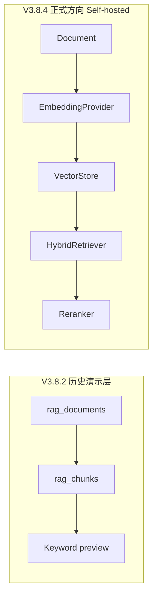

# V3.8.2 Local Coze-like RAG Demo Library

> **路线已调整**：后续正式 RAG **不再优先 Coze**，而是进入 [Self-hosted RAG Engine](./V3.8.4_SELF_HOSTED_RAG_ENGINE_PLAN.md) 方向。本文件为**历史演示层**，不删除。

> ⚠️ **Demo Library 是管理/预览辅助，不是最终 RAG 形态。** 向量原型见 [V3.8.3](./V3.8.3_MINIMAL_LOCAL_VECTOR_RAG_PLAN.md)；正式引擎路线见 [V3.8.4](./V3.8.4_SELF_HOSTED_RAG_ENGINE_PLAN.md)。

> 文档版本：1.0
> 状态：已落地
> 定位：V3.8 延续的**轻量演示库**；**不是**生产级向量 RAG，**不是** Coze Dataset 迁移。
> **V3.9** 仍保留给真正向量 RAG 闭环完成之后。

---

## 1. 本阶段不是什么

| 不是 | 说明 |
|---|---|
| 生产级向量 RAG | 仍使用 SQLite keyword retrieve，无 embedding / vector store |
| Coze Dataset 迁移 | 不调用 Coze API，不同步 Dataset |
| V3.9 | 向量 RAG 闭环完成前不启用该版本号 |

## 2. 本阶段要做什么

1. **本地演示** Agent 如何消费知识库（stats / 检索预览 / 导出预览）。
2. **本地验证** seed_knowledge / user_material / external_context 的治理边界。
3. **模拟 Coze Dataset** 的基本概念（单隐式 dataset + documents + chunks）。
4. **保留 Coze-like JSON 结构** 作为历史演示与结构参考（**已废弃**「正式部署优先 Coze」）。

**长期策略（已调整）**：正式方向为 **Self-hosted RAG Engine**（见 V3.8.4）；Coze 不再作为正式部署核心。

---

## 3. Coze Dataset 与本地映射

| Coze 概念 | 本地等价物 |
|---|---|
| datasetId | 隐式常量 `default_time_manager_context`（无独立表） |
| name / description | `DEFAULT_LOCAL_DATASET` 常量 |
| Document | `rag_documents` 行 |
| Chunk | `rag_chunks` 行 |
| document status | `status`: draft / active / archived |
| source type | `sourceType` |
| trust / quality | `trustLevel` |
| reviewed / enabled | `reviewedAt` + activate 流程 |
| hit count | 本轮未实现（可选未来字段） |
| processing status | 本轮未实现 |

---

## 4. Demo Library 能力

### 4.1 统计（`RagDemoLibraryService.getStats`）

- 文档总数、active / draft / archived 数量
- chunk 总数
- 按 `sourceType` 分布

UI：`RagKnowledgeManagerDialog` → Tab「统计」

### 4.2 检索预览（`previewRetrieve`）

- 输入 query，选择 sourceTypes（seed_knowledge / user_material / external_context）
- 展示命中：title、sourceType、score、content 摘录
- **仅 active 文档**（`RagService.retrieve` 默认）
- 不展示 SQL、embedding、chunk_index

UI：Tab「检索预览」

### 4.3 Coze-like 导出预览（`buildCozeLikeDatasetPreview`）

生成 JSON 预览，**不调用 Coze**：

```json
{
  "dataset": {
    "name": "Time Manager 本地演示知识库",
    "description": "...",
    "documents": [
      {
        "title": "...",
        "content": "...",
        "sourceType": "seed_knowledge",
        "tags": [],
        "status": "active",
        "trustLevel": "high"
      }
    ]
  },
  "meta": {
    "generatedAt": "...",
    "documentCount": 2,
    "includedSourceTypes": ["seed_knowledge", "user_material"],
    "excludedReason": { ... }
  }
}
```

导出规则：

| 规则 | 行为 |
|---|---|
| status | 仅 `active` |
| seed_knowledge | 默认导出 |
| user_material | 默认导出；`includeUserMaterial=false` 可关 |
| external_context | 默认不导出；`includeExternalContext=true` 才导出 |
| system_guidance | 永不导出 |
| memory_summary | 永不导出 |
| draft / archived | 永不导出 |

UI：Tab「导出预览」+ 复制 JSON

---

## 5. Knowledge / Memory / External 边界

| sourceType | 检索预览 | Chat 主路径 | 导出预览 |
|---|---|---|---|
| seed_knowledge | 可选 | 默认始终 | 默认包含 |
| user_material | 可选 | toggle ON + active | 默认包含 |
| external_context | 可选 | 不进 Chat（默认） | 默认排除 |
| memory_summary | 预留 | 不进 | 排除 |
| system_guidance | 排除 | 不进 | 排除 |

---

## 6. 实现文件

| 文件 | 作用 |
|---|---|
| [src/services/rag/RagDemoLibraryService.ts](../../src/services/rag/RagDemoLibraryService.ts) | stats / preview / export |
| [src/store/ragKnowledgeStore.ts](../../src/store/ragKnowledgeStore.ts) | Demo 状态与 actions |
| [src/components/rag/RagStatsPanel.tsx](../../src/components/rag/RagStatsPanel.tsx) | 统计 Tab |
| [src/components/rag/RagRetrievePreviewPanel.tsx](../../src/components/rag/RagRetrievePreviewPanel.tsx) | 检索预览 Tab |
| [src/components/rag/RagExportPreviewPanel.tsx](../../src/components/rag/RagExportPreviewPanel.tsx) | 导出预览 Tab |
| [src/services/rag/__tests__/ragDemoLibrary.test.ts](../../src/services/rag/__tests__/ragDemoLibrary.test.ts) | 11 条单测 |

`RagService` 新增（V3.8.2）：

- `countChunks()`
- `listChunksForDocument(documentId)`

---

## 7. 未来向量 RAG（路线已调整，仅文档）

> **已废弃**：「正式部署优先 Coze」。正式方向见 [V3.8.4_SELF_HOSTED_RAG_ENGINE_PLAN.md](./V3.8.4_SELF_HOSTED_RAG_ENGINE_PLAN.md)。



接口：`EmbeddingProvider`（V3.8.3）、`VectorStore` / `HybridRetriever` / `Reranker`（V3.8.4 骨架）— 见 V3.8.4 计划。

---

## 8. 安全要求（不可变）

- RAG 不调用 ToolRouter，不写 tasks / time_blocks。
- retrieve / export 默认只处理 active。
- external_context actionItems 永远是 candidate。
- memory_summary / system_guidance 不允许 UI 写入。
- user_material 进入 Chat 仍需全局 toggle + active 双门控。
- RAG 建议仍经 `sanitizeRecommendation`。

---

## 9. 验证

| 命令 | 结果 |
|---|---|
| `pnpm test` | 22 files / **247 tests** all green |

---

## 10. 一句话总结

V3.8.2 在 V3.8.1 之上增加 Coze-like Demo Library（历史演示层）。正式 RAG 方向已切至 V3.8.4 Self-hosted Engine，**不再**正式部署优先 Coze，**不命名 V3.9**。
