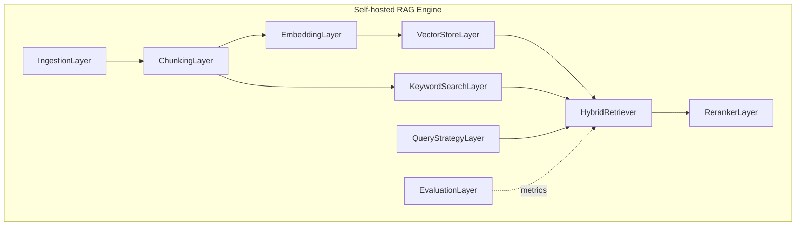

# V3.8.4 Self-hosted RAG Engine

> 文档版本：1.0  
> 状态：路线已定；接口骨架已落地；生产能力分阶段演进  
> **路线已调整**：后续正式 RAG **不再优先 Coze**，而是进入 **Self-hosted RAG Engine** 方向。  
> V3.8.2 Coze-like Demo Library 仅保留为**历史演示层**，不删除、不推翻 V3.8.1 / V3.8.2 / V3.8.3 已有实现。

---

## 1. 路线变更声明

| 旧路线（已废弃为正式核心） | 新路线 |
|---|---|
| 正式部署优先 Coze Dataset / Knowledge Base | **自建完整、高性能、可部署的 RAG 引擎** |
| 本地 RAG 仅演示，不扩张 | 本地引擎为**正式方向**；Coze-like 仅结构参考 |
| V3.8.3 `vector_json` + deterministic 当作可行生产方案 | V3.8.3 仅 **dev fallback**；生产需 EmbeddingProvider + VectorStore + FTS/BM25 |

**V3.9** 仍留给：真向量库闭环稳定、多模型、生产 Reranker、评测体系封板后再启用版本号。

---

## 2. 当前已有能力

### V3.8.1 — Knowledge Manager

- 资料录入、`draft` / `active` / `archived`、`trustLevel`、`reviewedAt`
- `RagIngestionService` + `validateSourceTypePolicy`
- `external_context` 默认 draft；`system_guidance` / `memory_summary` UI 拒绝写入
- Settings `VITE_ENABLE_RAG_ADMIN` 全屏 Dialog
- `user_material` 进入 Chat：**Settings toggle + 文档 active** 双门控

### V3.8.2 — Local Coze-like Demo Library（历史演示层）

- `RagDemoLibraryService`：统计 / keyword 检索预览 / Coze-like 导出预览 JSON
- **不调 Coze API**；仅供管理 UI 调试与结构参考
- **不是**未来主 RAG 形态

### V3.8.3 — 最小真实向量 RAG 原型（dev fallback）

- migration v8：`rag_embeddings` + `vector_json`
- `DeterministicEmbeddingProvider` + `VectorRagService` + `retrieveHybrid`（vector → keyword fallback）
- Chat 主路径：`SqliteRagAdapter` + `chatStore` 注入，**本轮不改动**
- App 启动：`embedMissingChunks()` 幂等

### 当前仍**不是**高性能生产 RAG

- 无生产级 embedding API 默认路径
- 无真正 VectorStore（sqlite-vec / pgvector / Qdrant）
- 无 FTS5 / BM25 keyword 层
- 无 score fusion（RRF / 加权）hybrid
- 无 cross-encoder / LLM Reranker
- 无 RAG 评测闭环（固定 query、召回率、延迟）

---

## 3. 完整 RAG Engine 九层设计

### 3.1 Ingestion Layer

| 维度 | 说明 |
|---|---|
| **当前** | `RagIngestionService` + Policy；`RagService.ingestDocument` 事务 |
| **目标** | 导入管线、清洗、metadata 标注、批量 reindex 触发 |
| **演进** | 沿用 Policy；`external_context` 强制 draft；禁止 UI 写 `memory_summary` / `system_guidance` |

### 3.2 Chunking Layer

| 维度 | 说明 |
|---|---|
| **当前** | `ragRanking.chunkText` 基础切分 |
| **目标** | 按标题/段落/长度/语义边界；保留 `documentId`、`chunkIndex`、`sourceType`、`tags`、`sourceRef`、`metadata` |
| **演进** | 可插拔 `ChunkingStrategy` 接口；默认保持现有行为 |

### 3.3 Embedding Layer

| 维度 | 说明 |
|---|---|
| **当前** | `EmbeddingProvider` + `DeterministicEmbeddingProvider`（dev）+ OpenAI 草案（未接主路径） |
| **目标** | 生产 provider：OpenAI-compatible / 本地模型；记录 `embeddingModel`、`embeddingVersion`、`dimensions`；模型变更后 **reindex** |
| **演进** | `DeterministicEmbeddingProvider` **仅 dev fallback** |

### 3.4 VectorStore Layer

| 维度 | 说明 |
|---|---|
| **当前** | V3.8.3 内存 cosine + `rag_embeddings.vector_json`；**V3.8.4 已定义** [`VectorStore`](../../src/services/rag/vector/VectorStore.ts) 接口 |
| **目标** | 可插拔后端：sqlite-vec、pgvector、Qdrant；`topK`、`score`、`metadata filter` |
| **演进** | 实现 adapter，不锁死单一库；本轮**不接**实体大型库 |

### 3.5 Keyword Search Layer

| 维度 | 说明 |
|---|---|
| **当前** | `RagService.retrieve`：SQL LIKE + 内存评分 |
| **目标** | FTS5 / BM25；作为 hybrid **正式组成部分**，非玩具兜底 |
| **演进** | migration 增 FTS 虚表或 sidecar 索引表 |

### 3.6 Hybrid Retriever

| 维度 | 说明 |
|---|---|
| **当前** | V3.8.3：vector 有命中则返回，否则 keyword；**V3.8.4** [`HybridRetriever`](../../src/services/rag/retrieval/HybridRetriever.ts) + `LegacyHybridRetriever` 委托现有行为 |
| **目标** | 并行召回 vector + keyword；RRF 或归一化加权 fusion |
| **演进** | 过滤不变：`status=active`、`deleted_at IS NULL`、`sourceTypes`；`user_material` 双门控 |

### 3.7 Reranker Layer

| 维度 | 说明 |
|---|---|
| **当前** | **V3.8.4** [`Reranker`](../../src/services/rag/rerank/Reranker.ts) + `NoopReranker` |
| **目标** | cross-encoder / LLM rerank；**只调排序，不改业务数据** |
| **演进** | 初期 identity / 规则 reranker |

### 3.8 Query Strategy Layer

| 维度 | 说明 |
|---|---|
| **当前** | `RecommendationHandler` 语义化 query（userInput + blockTitles） |
| **目标** | normalization；可选 rewrite / HyDE（**非第一阶段**） |
| **演进** | 时间管理场景优先：用户输入 + 当前上下文 + task/block title |

### 3.9 Evaluation Layer

| 维度 | 说明 |
|---|---|
| **当前** | 单元测试覆盖 ingest/retrieve/hybrid；无固定评测集 |
| **目标** | 固定 test query、期望文档、召回率@K、延迟基准 |
| **演进** | `ragEvaluation.test.ts` 或独立 harness；用数据判断 RAG 是否变好 |

---

## 4. 本阶段明确暂不做

- GraphRAG / Agentic RAG / Self-RAG / CRAG / 多 Agent 检索
- 大规模知识图谱
- RAG 自动写 `tasks` / `time_blocks`
- RAG 绕过 ToolRouter / ConfirmationPolicy
- Memory 自动写入 RAG
- HyDE / 复杂 Agentic query（第一阶段）
- 命名 **V3.9**（封板前）

---

## 5. Memory 与 RAG 边界

| 概念 | 职责 |
|---|---|
| **RAG** | 可检索资料库：专业知识、用户手动材料、外部资料摘要 |
| **Memory** | 用户长期习惯、偏好、执行规律（`MockMemoryAdapter` 等） |
| **memory_summary** | 仅预留 `sourceType`；**不允许 UI 写入** |
| **Memory → RAG** | 未来必须走**独立 system actor 管线**；不能走普通 UI，不能让 Agent 自行写入 |

---

## 6. V3.8.4 接口预备（已落地骨架）

| 模块 | 路径 | 说明 |
|---|---|---|
| VectorStore | `src/services/rag/vector/VectorStore.ts` | 接口 only；无实体 adapter |
| HybridRetriever | `src/services/rag/retrieval/HybridRetriever.ts` | `LegacyHybridRetriever` → `VectorRagService.retrieveHybrid` |
| Reranker | `src/services/rag/rerank/Reranker.ts` | `NoopReranker` |
| VectorRagService | `src/services/rag/VectorRagService.ts` | **不重命名**；文档角色 = LocalVectorRagService / dev fallback |

**刻意未改动**：`SqliteRagAdapter`、`chatStore`、`App.tsx`、`migrations.ts`。

---

## 7. 安全边界（继续满足）

- RAG **不**调用 ToolRouter；**不**写 `tasks` / `time_blocks`
- RAG 结果仅作 Agent 参考；写操作经 ToolRouter / ConfirmationPolicy / ActionLog
- `external_context.actionItems` 永远是 candidate
- `system_guidance` / `memory_summary` 不允许 UI 写入
- `user_material` 进入 Chat：toggle + active
- 检索：`deleted_at IS NULL`；默认 `status=active`

---

## 8. 工程切片（建议执行顺序）

| 切片 | 内容 | 依赖 |
|---|---|---|
| **12a (V3.8.4)** | 路线文档 + 旧文档 Coze 表述更新 + 接口骨架 + 测试 | **✅** |
| **13 (V3.8.5)** | FTS5 + `KeywordSearch` + `SqliteVectorStore` + RRF `SelfHostedHybridRetriever` | **✅** 见 [V3.8.5](./V3.8.5_SELF_HOSTED_RAG_ENGINE_MVP_PLAN.md) |
| **14** | 生产 `EmbeddingProvider` 默认 + reindex 管理 UI | 待做 |
| **15** | `VectorStore` pgvector / Qdrant adapter | 待做 |
| **16 (V3.8.5)** | RRF fusion + `NoopReranker` hook | **✅** |
| **17 (V3.8.5)** | `RagEvaluationService` harness | **✅** |
| **18 (V3.8.5)** | Chat feature flag `VITE_RAG_ENGINE=self_hosted` | **✅** |

---

## 9. V3.9 封板条件（预告）

- 生产 VectorStore + Embedding 稳定
- Hybrid + Reranker + Evaluation 闭环有数据支撑
- 安全边界审计通过
- 届时才启用 **V3.9** 版本号封板

---

## 10. 仍未完成的 RAG 引擎能力清单

以下能力**尚未**在本仓库生产路径落地，供后续切片对照：

1. **生产 EmbeddingProvider** — OpenAI-compatible / 本地模型为默认；非 deterministic
2. **真 VectorStore adapter** — sqlite-vec / pgvector / Qdrant 择一实现
3. **FTS5 / BM25 Keyword Search** — 替代纯 LIKE 作为主 keyword 通道
4. **Hybrid score fusion** — RRF 或加权合并，非「vector 空才 keyword」
5. **生产 Reranker** — cross-encoder / LLM rerank（当前仅 `NoopReranker`）
6. **Query rewrite / HyDE** — 可选，非 P0
7. **Evaluation harness** — 固定 query、期望命中、召回@K、P95 延迟
8. **Chunking 策略插件** — 标题/段落/语义边界
9. **批量 reindex / 模型迁移** — embedding 版本变更后的全量重建
10. **Memory → RAG system actor 管线** — 非 UI、非 Agent 直写
11. **Chat 主路径切换** — 从 V3.8.3 `VectorRagService` 直连 → 新 `HybridRetriever` 栈（需 feature flag + 评测达标）

---

## 11. 一句话总结

V3.8.4 把项目从「Coze 优先」调整为「**自建 Self-hosted RAG Engine**」：保留 V3.8.1–3 全部成果，用接口骨架（VectorStore / HybridRetriever / Reranker）为高性能 RAG 铺路，**不**在本轮接大型向量库或改 Chat 主路径。
