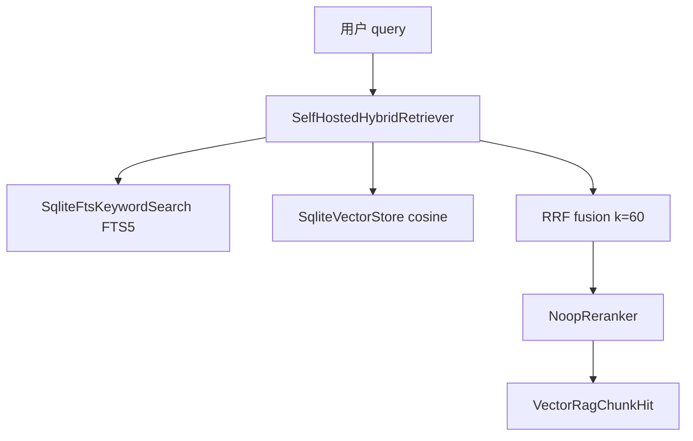

# V3.8.5 Self-hosted RAG Engine MVP

> 文档版本：1.0  
> 状态：已落地（可运行代码）  
> V3.8.4 = 路线 + 接口骨架；**V3.8.5 = 第一版可运行自建 RAG 引擎**。

---

## 1. 能力概览

| 模块 | 实现 | 说明 |
|---|---|---|
| KeywordSearch | `SqliteFtsKeywordSearch` | SQLite FTS5 `rag_chunks_fts`（migration v9）；失败 fallback `RagService.retrieve` |
| VectorStore | `SqliteVectorStore` | 复用 `rag_embeddings` + 内存 cosine |
| Hybrid | `SelfHostedHybridRetriever` | 并行 vector + keyword → **RRF**（k=60）→ `NoopReranker` |
| Evaluation | `RagEvaluationService` | 固定 case → hit@K |
| Chat 接入 | `VITE_RAG_ENGINE=self_hosted` | 默认仍 V3.8.3；flag 开启时用 Self-hosted 栈 |

---

## 2. Feature Flag

```env
VITE_RAG_ENGINE=self_hosted
```

- **未设置 / 其他值**：Chat 走 `VectorRagService.retrieveHybrid`（V3.8.3）
- **`self_hosted`**：`SqliteRagAdapter` 注入 `SelfHostedHybridRetriever`；失败自动 fallback V3.8.3

App 启动（`self_hosted` 时）额外执行：`SqliteFtsKeywordSearch.rebuildIndex()`（失败仅 warn）。

---

## 3. 数据流



---

## 4. 类型扩展

- `VectorRagChunkHit.retrieveMode`: `"vector" | "keyword" | "hybrid"`
- `retrievalSources?: Array<"vector" | "keyword">`
- `RagPreviewRetrieveMode`: Demo 面板 keyword / vector / hybrid

---

## 5. Demo UI

`RagRetrievePreviewPanel` 支持三种检索模式（默认 **hybrid**），不再表述 Coze 为正式方向。

---

## 6. 测试

- `keywordSearch.test.ts`
- `sqliteVectorStore.test.ts`
- `selfHostedHybridRetriever.test.ts`
- `ragEvaluation.test.ts`

**295 tests** 全绿（含 V3.8.5 新增用例）。

---

## 7. 安全边界（保持）

- RAG 不调用 ToolRouter；不写 tasks / time_blocks
- 默认只检索 `active` + `deleted_at IS NULL`
- `user_material` 双门控不变
- Agent 不触发 FTS rebuild

---

## 8. 仍未完成的生产能力

1. **pgvector / Qdrant / sqlite-vec** 真 VectorStore adapter  
2. **生产 EmbeddingProvider** 为默认路径（非 deterministic）  
3. **生产 Reranker**（cross-encoder / LLM）  
4. **增量 FTS 同步**（ingest/activate 时自动更新 FTS，非仅启动 rebuild）  
5. **批量 reindex 管理 UI**  
6. **扩展 Evaluation dataset**（真实业务 golden set）  
7. **Chat 默认切换** 到 self_hosted（需评测达标 + 去 feature flag）  

**V3.9** 仍留给上述生产能力稳定后封板。

---

## 9. 下一步：V3.8.6 骨架化

V3.8.5 MVP 已可运行；**V3.8.6** 在其上搭建完整 RAG Engine 工程骨架（`RagEngine` 统一入口、`RagIndexManager`、`RagRetrievalPipeline`、`RagAdminActions` 等），Chat 在 `self_hosted` 时优先走 `RagEngine`，失败仍回退本 MVP 路径。

详见 [V3.8.6_RAG_ENGINE_SCAFFOLD_PLAN.md](./V3.8.6_RAG_ENGINE_SCAFFOLD_PLAN.md)。

---

## 10. 相关文件

- `src/services/rag/keyword/`
- `src/services/rag/vector/SqliteVectorStore.ts`
- `src/services/rag/retrieval/SelfHostedHybridRetriever.ts`
- `src/services/rag/retrieval/buildSelfHostedHybridRetriever.ts`
- `src/services/rag/eval/RagEvaluationService.ts`
- `src/db/migrations.ts` v9
