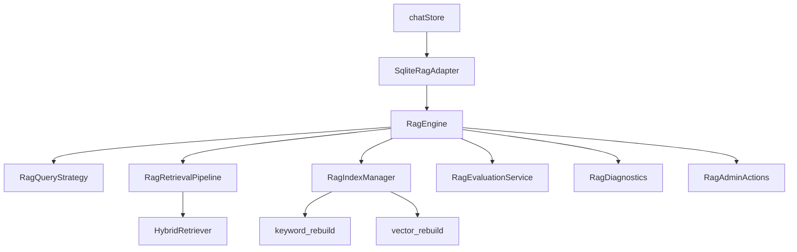

# V3.8.6 RAG Engine Scaffold / Kernel

> V3.8.5 = 第一版可运行 MVP；**V3.8.6 = 完整工程骨架（统一入口 + 可配置管线）**。  
> 默认 Chat 路径仍为 V3.8.3 legacy；`VITE_RAG_ENGINE=self_hosted` 时装配完整栈。

---

## 1. 路线



| 阶段 | 内容 |
|------|------|
| V3.8.5 | FTS5 + SqliteVectorStore + RRF + 评测脚手架 |
| **V3.8.6** | **RagEngine / IndexManager / Pipeline / Metrics / Admin** |
| 后续 | pgvector、生产 embedding、真 reranker、async job、Admin UI |

**V3.9** 仍留给生产能力稳定后封板（本轮不命名实现）。

---

## 2. 模块边界

| 模块 | 路径 | 职责 |
|------|------|------|
| **RagEngineConfig** | `engine/RagEngineConfig.ts` | `legacy` / `self_hosted` 配置与默认值 |
| **RagEngine** | `engine/RagEngine.ts` | retrieve / ingest / activate / index / evaluate / health |
| **RagEngineFactory** | `engine/RagEngineFactory.ts` | env 解析 + 装配 |
| **RagIndexJob** | `indexing/RagIndexJob.ts` | 任务类型与 mark* 工具 |
| **RagIndexManager** | `indexing/RagIndexManager.ts` | keyword/vector rebuild、document refresh、内存 job 环 |
| **RagQueryStrategy** | `query/` | 查询计划（默认规则版，无 LLM） |
| **RagRetrievalPipeline** | `pipeline/` | buildQuery → retrieve → rerank → truncate |
| **RagMetrics / RagDiagnostics** | `metrics/` | 计时、健康、管线诊断 |
| **RagAdminActions** | `admin/RagAdminActions.ts` | 管理入口（仅服务层，本轮不改 Dialog UI） |

---

## 3. 核心接口

### RagEngine

- `retrieve(query, opts?)` → `{ hits, snippets, diagnostics }`
- `ingest` → 委托 `RagIngestionService.createDraftDocument`
- `activateDocument` → activate + `refreshDocument` job
- `rebuildIndexes` / `rebuildKeywordIndex` / `rebuildVectorIndex`
- `evaluate` → 需 `enableEvaluation=true`
- `healthCheck` → keyword/vector backend

### SqliteRagAdapter 优先级

`ragEngine` > `hybridRetriever` > `vectorService` > `RagService.retrieve`（keyword LIKE）

### chatStore

`self_hosted` 时 `createDefaultRagEngine()`；构造失败回退 V3.8.5 `buildSelfHostedHybridRetriever()`。

---

## 4. Feature flag

```bash
VITE_RAG_ENGINE=self_hosted
```

- **未设置 / 其他值**：legacy（`LegacyHybridRetriever` + V3.8.3 行为）
- **self_hosted**：完整 Self-hosted 栈经 `RagEngine` 统一入口

---

## 5. 测试

新增 6 个测试文件（`ragEngine` / `ragIndexManager` / `ragQueryStrategy` / `ragRetrievalPipeline` / `ragDiagnostics` / `ragAdminActions`）。

**322 tests** 全绿（35 files）。

---

## 6. 安全边界（保持）

- RAG 不调用 ToolRouter；不写 tasks / time_blocks
- 管线阶段失败仅 `fallbackUsed=true`，不向 Chat 抛业务异常
- Agent 不触发 rebuild（仅 `RagAdminActions`）

---

## 7. 下一步：V3.8.7 Production Pack

V3.8.6 骨架已就绪；**V3.8.7** 填充生产化能力（Embedding/VectorStore/Reranker 工厂、Reindex 增强、Eval dataset、Admin UI、Memory bridge）。

详见 [V3.8.7_RAG_PRODUCTION_PACK_PLAN.md](./V3.8.7_RAG_PRODUCTION_PACK_PLAN.md)。

---

## 8. 仍未完成

1. pgvector / Qdrant / sqlite-vec 真 VectorStore adapter  
2. 生产 EmbeddingProvider / Reranker 默认路径  
3. 增量 FTS 同步（ingest 时自动更新）  
4. async index job 队列  
5. Settings / Knowledge Manager 接 `RagAdminActions`（health、reindex、evaluation UI）  
6. 扩展 Evaluation golden set  
7. Chat 默认切换 self_hosted（需评测达标）

---

## 9. 相关文件

- `src/services/rag/engine/`
- `src/services/rag/indexing/`
- `src/services/rag/query/`
- `src/services/rag/pipeline/`
- `src/services/rag/metrics/`
- `src/services/rag/admin/`
- `src/agent/memory/SqliteRagAdapter.ts`
- `src/store/chatStore.ts`
