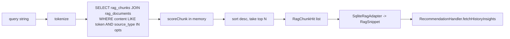

# V3.8 RAG Foundation 实施计划与封板说明

> 文档版本：1.1（含收口修正）
> 状态：已落地并完成收口修正（2026-06-01）
> 定位：**Product V5 Production Memory 的第 1 步**，单独完成但不构成 V5 封板。

---

## 1. 版本定位

参考 [docs/ROADMAP_REBASE_AFTER_AGENT_V5.md](../ROADMAP_REBASE_AFTER_AGENT_V5.md) §4：

> Product V5 Production Memory
> 4. 实现轻量 ProductionRagAdapter，先做本地摘要检索，不急于接向量库。

V3.8 完成的是这一步骤的**地基**：

- 落实 RAG 数据模型与 service 层。
- 提供生产级 RagAdapter 实现（`SqliteRagAdapter`），可被 `RecommendationHandler` 直接消费。
- 首次让用户在 Chat 中看到来自真实知识库的建议注脚。

V3.8 不做的事（留给后续）：

- Memory 生产化（Product V5 第 2-3 步：`ProductionMemoryAdapter`）。
- 真实向量数据库 / FTS5 接入。
- `external_context` 写入端（属于 Product V4 Import Foundation）。

---

## 2. 交付清单

### 2.1 新增文件

| 文件 | 作用 |
|---|---|
| `src/types/rag.types.ts` | `RagSourceType / RagDocument / RagChunk / RagChunkHit / IngestChunkInput / IngestDocumentInput / RagQueryOptions`（tags 注释已明确为 score boost） |
| `src/services/rag/ragRanking.ts` | 纯函数：`tokenize / chunkText / scoreChunk` |
| `src/services/rag/RagService.ts` | `ingestDocument`（含事务）`/ retrieve / getDocument / listDocuments / deleteDocument / findDocumentByTitle`；构造函数支持注入 `RagDb` 以便测试 |
| `src/services/rag/seedRagKnowledge.ts` | 5 条时间管理理论 seed_knowledge，幂等写入 |
| `src/services/rag/__tests__/ragRanking.test.ts` | 25+ 条单测（分词/切块/评分/Adapter 映射/sanitize/语义 query/事务） |
| `src/agent/memory/SqliteRagAdapter.ts` | 实现现有 `RagAdapter` 接口的生产 adapter |
| `src/agent/memory/sanitizeRecommendation.ts` | 轻量 sanitize：去除内部名/JSON指令/命令口吻（纯函数） |
| `docs/V3.8/V3.8_IMPLEMENTATION_PLAN.md` | 本文 |

### 2.2 修改文件

| 文件 | 改动范围 |
|---|---|
| `src/db/migrations.ts` | 追加 `version: 6` migration，建 `rag_documents + rag_chunks` 两表 |
| `src/App.tsx` | `runMigrations()` 后调用 `seedRagKnowledge(new RagService())`；失败静默降级，不阻塞主流程 |
| `src/store/chatStore.ts` | **[收口]** `AgentService` 改为注入 `SqliteRagAdapter({ defaultSourceTypes: ["seed_knowledge"] })`，接入 Chat 主路径 |
| `src/agent/AgentService.ts` | 1) 引入 `RecommendationHandler` + `sanitizeRecommendation`；2) `maybeAppendRecommendation` 接收 `userInput`，构造语义化 ragQuery；3) 追加前过 sanitize |
| `src/agent/time-management/RecommendationHandler.ts` | **[收口]** `generateRecommendation` 新增可选 `ragQuery?: string`；不传时退化到 block 标题；不再使用 `currentDatetime` 作为 RAG query |
| `docs/V3.7/CURRENT_ARCHITECTURE.md` | §12 更新，反映收口修正后的完整状态 |

### 2.3 完全不动的文件

- `src/agent/memory/RagAdapter.ts`（接口与 `RagSnippet` 形状保持向后兼容）
- `src/agent/memory/MockRagAdapter.ts`（测试默认仍用它）
- `src/agent/memory/MemoryAdapter.ts`
- `src/agent/testing/createMockAgentHarness.ts`（测试路径完全走 Mock）

---

## 3. 数据模型

`migration v6` 创建两张表：

```sql
rag_documents (
  id, source_type, title, summary, source_ref,
  tags_json, metadata_json, created_at, updated_at, deleted_at
)
-- source_type 枚举：seed_knowledge / external_context / user_material / memory_summary / system_guidance

rag_chunks (
  id, document_id, chunk_index, content,
  tags_json, source_ref, metadata_json, token_count, created_at
)
```

幂等模式：两张表都存在时直接返回，对齐 v4/v5 的迁移风格。

---

## 4. 检索流水线



v1 使用 LIKE 全表扫，单机数据量下可接受；接口稳定，未来可平滑替换为 FTS5 / sqlite-vec。

---

## 5. 安全边界（不可变）

- RAG **不**调用 `ToolRouter`，**不**写 `tasks / time_blocks`。
- `external_context` 的 `actionItems` 永远是 candidate，必须走 Import Proposal → 用户确认 → ToolRouter，不允许从 RAG 短路到执行层。
- `external_context / user_material` **默认不进入用户可见建议**：`chatStore` 中 `SqliteRagAdapter` 配置 `sourceTypes: ["seed_knowledge"]`，其他来源被硬过滤。
- `RecommendationHandler` 产出的建议只作为消息注脚追加：
  - 不创建 confirmation。
  - 不写 ActionLog。
  - 不触发 refresh hints。
- 注脚追加前必须通过 `sanitizeRecommendation`：
  - 去除 `ToolRouter / toolName / semantic_frame` 等内部名称。
  - 去除 JSON/数组结构片段。
  - 命令口吻段落整段丢弃，返回空串则跳过追加。
- 注脚追加规则：
  - `suggestionKind = "suggestion"` 或 `"confirmation_required"` 时追加。
  - `suggestionKind = "executable_action"`（"计划合理"）**不**追加。
  - 当响应中存在 `confirmationId` 时**不**追加，避免干扰确认流。
  - 任何异常静默降级为不追加，绝不阻塞主响应。
- `RagQueryOptions.tags` **仅**参与相关性排序加权（score boost），不作为访问控制或硬过滤；真正的权限过滤由 `sourceTypes / owner_id / workspace_id` 等字段承担（当前版本暂不引入）。

---

## 6. Seed 知识

5 条时间管理理论（写入 `seed_knowledge` sourceType）：

| 标题 | 主标签 |
|---|---|
| 番茄工作法 | 专注 / 休息 / 效率 / 番茄钟 |
| 艾宾浩斯遗忘曲线 | 复习 / 记忆 / 间隔重复 / 学习 |
| 精力曲线与时段分配 | 时段 / 效率 / 深度工作 / 精力管理 |
| GTD 两分钟原则 | GTD / 任务管理 / 决策 / 两分钟原则 |
| 上下文切换成本 | 专注 / 任务切换 / 碎片时间 / 深度工作 |

写入策略：按 `(sourceType, title)` 查重，已存在则跳过；启动失败不阻塞 App 初始化。

---

## 7. 验证结果

| 命令 | 结果 |
|---|---|
| `pnpm exec tsc --noEmit`（RAG 相关文件） | 通过，无新增类型错误 |
| `pnpm test --run` | **20 files / 218 tests, all green** |
| RAG 单测（收口修正后） | 25+ 条全通（含 sanitize / 语义 query / 事务 ROLLBACK） |
| Chat 主路径注入 | `chatStore.ts` 注入 `SqliteRagAdapter`，`sourceTypes: ["seed_knowledge"]` |
| Heartbeat AgentService | 未注入 RAG，防止污染 |

预先存在的 4 处 `__tests__` 类型错误（HeartbeatService.feedbackSnooze / TaskService.deleteCascade / TimeBlockService.updateStatus）与 V3.8 改动无关，本期不在 scope。

---

## 8. 未来可替换点

| 替换 | 接口稳定？ | 备注 |
|---|---|---|
| LIKE 检索 → SQLite FTS5 虚拟表 | 是 | `RagService.retrieve` 签名不变 |
| `rag_chunks` 增加 `embedding BLOB` → sqlite-vec | 是 | 双路召回融合，接口可扩展 |
| `RagSnippet` 增加可选 `documentId / sourceType / tags` 字段 | 向后兼容 | 让 `RecommendationHandler` 能基于来源差异化文案 |
| `ProductionMemoryAdapter`（SQL 聚合 `tasks / time_blocks / agent_action_logs`） | 现有 `MemoryAdapter` 接口稳定 | Product V5 Step 2-3 |
| `UserProfileService`（统计→语义约束注入 prompt） | 新增 | Product V5 Step 后续 |
| `ExternalContextIngestor`（消费 `v3-external-context-plugin` brief JSON） | 通过 `RagService.ingestDocument` 写入 | Product V4 Import Foundation |

---

## 9. 提交切片回顾

| 切片 | 内容 | 状态 |
|---|---|---|
| 1 | `rag.types.ts` + migration v6 | ✅ |
| 2 | `ragRanking.ts` + `ragRanking.test.ts` | ✅ |
| 3 | `RagService.ts` | ✅ |
| 4 | `SqliteRagAdapter.ts` + 形状映射测试 | ✅ |
| 5 | `seedRagKnowledge.ts` + `App.tsx` 集成 | ✅ |
| 6 | `AgentService.ts` 接入 `RecommendationHandler` | ✅ |
| 7 | 文档归档（本文 + CURRENT_ARCHITECTURE.md §12 更新） | ✅ |
| **8（收口修正）** | **chatStore.ts 注入 SqliteRagAdapter / 语义化 query / sanitizeRecommendation / RagService 事务 / tags 注释 / 测试补齐** | **✅** |
| **9 (V3.8.1)** | **RAG Knowledge Manager + Vector Prep**：migration v7 引入 status/trust_level/reviewed_at；`RagIngestionService` + Policy；SettingsPage feature-flagged 全屏 Dialog 入口；user_material 双门控；`RagService.retrieve` 默认 active-only；详见 [V3.8.1_RAG_KNOWLEDGE_MANAGER_PLAN.md](./V3.8.1_RAG_KNOWLEDGE_MANAGER_PLAN.md) | **✅** |

切片 6 是首次产生用户可见效果的节点：用户在 Chat 里完成排期后，会看到以 `---\n💡` 分隔的建议注脚。切片 8 收口修正确保这条路径使用真实 RAG 而非仅凭 Mock，且建议内容经过安全清洗。切片 9（V3.8.1）提供维护期 UI 录入/审核/启用语料能力，可通过 `VITE_ENABLE_RAG_ADMIN` 封藏入口，但仍不是真正向量库。

> 版本约束：V3.8.1 仍属于 V3.8 延续；**V3.9** 留给真正向量 RAG（Embedding + VectorStore + HybridRetriever + Reranker）闭环完成之后再启用。

---

## 10. 一句话总结

V3.8 把 RAG 从"接口骨架 + Mock 摘要"升级为"本地实表 + 真实检索 + 主路注脚 + 安全清洗"，但**严格保留**写入路径的安全壳：所有写操作仍必须经过 ToolRouter / ConfirmationPolicy / ActionLog，RAG 只是上下文来源，且只有 `seed_knowledge` 可见于用户，其余 sourceType 在治理就绪前不进入回复。

**V3.8.1 延续**：在不引入向量库的前提下，给 RAG 加上 `status / trust_level / reviewed_at` 治理三件套和可视化 Knowledge Manager；user_material 进入 Chat 检索受"全局开关 AND 文档 active"双门控；V3.9 留待真正向量 RAG 闭环。
